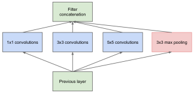
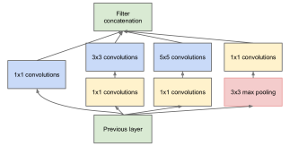

#! https://zhuanlan.zhihu.com/p/564141144
# [Notes][Vision][CNN] InceptionNetV1/GoogLeNet

* url: https://arxiv.org/abs/1409.4842
* Title: Going Deeper with Convolutions
* Year: 17 Sep `2014`
* Authors: Christian Szegedy, Wei Liu, Yangqing Jia, Pierre Sermanet, Scott Reed, Dragomir Anguelov, Dumitru Erhan, Vincent Vanhoucke, Andrew Rabinovich
* Institutions: [Google Inc.], [University of North Carolina, Chapel Hill], [University of Michigan]
* Abstract: We propose a deep convolutional neural network architecture codenamed "Inception", which was responsible for setting the new state of the art for classification and detection in the ImageNet Large-Scale Visual Recognition Challenge 2014 (ILSVRC 2014). The main hallmark of this architecture is the improved utilization of the computing resources inside the network. This was achieved by a carefully crafted design that allows for increasing the depth and width of the network while keeping the computational budget constant. To optimize quality, the architectural decisions were based on the Hebbian principle and the intuition of multi-scale processing. One particular incarnation used in our submission for ILSVRC 2014 is called GoogLeNet, a 22 layers deep network, the quality of which is assessed in the context of classification and detection.

----------------------------------------------------------------------------------------------------

## Summary of Main Contributions

* Smaller model.

----------------------------------------------------------------------------------------------------

## 1 Introduction

> In general, one can view the Inception model as a logical culmination of  [12] while taking inspiration and guidance from the theoretical work by Arora et al [2].

## 2 Related Work

> However, in our setting, 1x1 convolutions have dual purpose: most critically, they are used mainly as dimension reduction modules to remove computational bottlenecks, that would otherwise limit the size of our networks.

## 3 Motivation and High Level Considerations

    
    

> The most straightforward way of improving the performance of deep neural networks is by increasing their size. This includes both increasing the depth – the number of levels – of the network and its width: the number of units at each level.

> The fundamental way of solving both issues would be by ultimately moving from fully connected to sparsely connected architectures, even inside the convolutions. Besides mimicking biological systems, this would also have the advantage of firmer theoretical underpinnings due to the groundbreaking work of Arora et al. [2].

> On the downside, today’s computing infrastructures are very inefficient when it comes to numerical calculation on non-uniform sparse data structures.

> However, convolutions are implemented as collections of dense connections to the patches in the earlier layer.

> This raises the question whether there is any hope for a next, intermediate step: an architecture that makes use of the extra sparsity, even at filter level, as suggested by the theory, but exploits our current hardware by utilizing computations on dense matrices.

## 4 Architectural Details

> The main idea of the Inception architecture is based on finding out how an optimal local sparse structure in a convolutional vision network can be approximated and covered by readily available dense components.

> This leads to the second idea of the proposed architecture: judiciously applying dimension reductions and projections wherever the computational requirements would increase too much otherwise.

> That is, 1x1 convolutions are used to compute reductions before the expensive 3x3 and 5x5 convolutions. Besides being used as reductions, they also include the use of rectified linear activation which makes them dual-purpose.

## 5 GoogLeNet

> All the convolutions, including those inside the Inception modules, use rectified linear activation.

> All these reduction/projection layers use rectified linear activation as well.

Auxiliary Networks

> One interesting insight is that the strong performance of relatively shallower networks on this task suggests that the features produced by the layers in the middle of the network should be very discriminative.

> By adding auxiliary classifiers connected to these intermediate layers, we would expect to encourage discrimination in the lower stages in the classifier, increase the gradient signal that gets propagated back, and provide additional regularization.

> During training, their loss gets added to the total loss of the network with a discount weight (the losses of the auxiliary classifiers were weighted by 0.3).

> At inference time, these auxiliary networks are discarded.

## 6 Training Methodology

## 7 ILSVRC 2014 Classification Challenge Setup and Results

## 8 ILSVRC 2014 Detection Challenge Setup and Results

## 9 Conclusions

## 10 Acknowledgements

> Our results seem to yield a solid evidence that approximating the expected optimal sparse structure by readily available dense building blocks is a viable method for improving neural networks for computer vision.

----------------------------------------------------------------------------------------------------

## References

* Szegedy, Christian, et al. "Going deeper with convolutions." *Proceedings of the IEEE conference on computer vision and pattern recognition*. 2015.

## Further Reading

* [6] R-CNN
* [9] [AlexNet](https://zhuanlan.zhihu.com/p/565285454)
* [10] LeNet
* [12] Network In Network (NIN)
* [14] OverFeat
* [21] ZFNet
