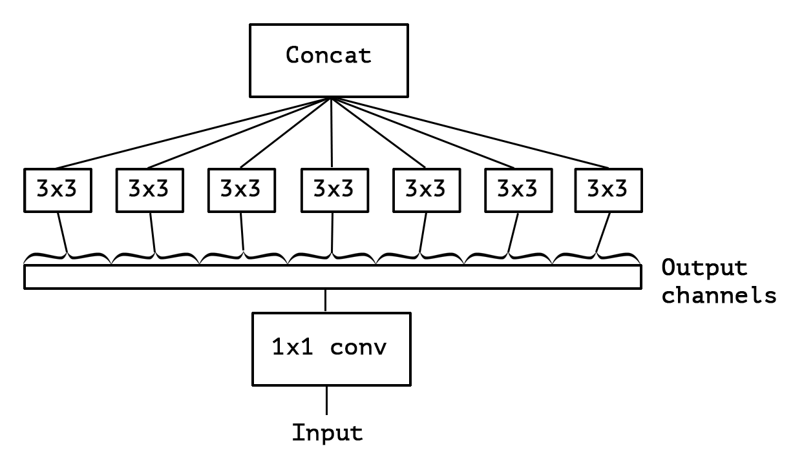
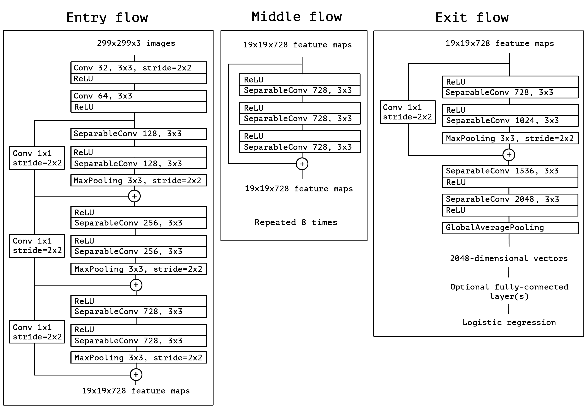
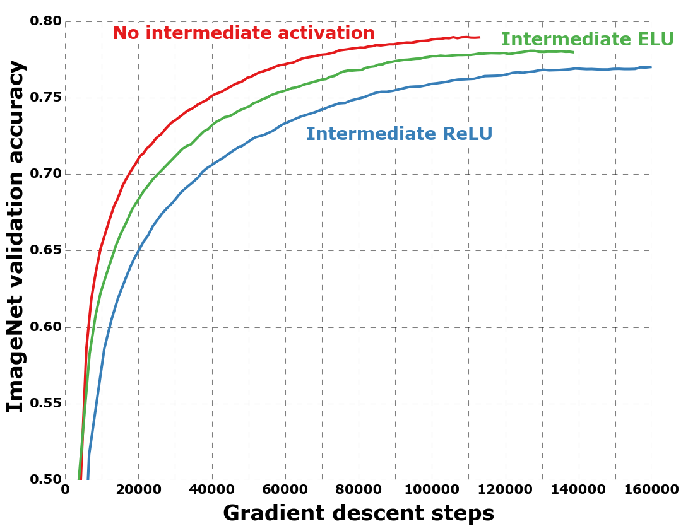

#! https://zhuanlan.zhihu.com/p/556794897
# [Notes][Vision][CNN] Xception Networks <!-- omit in toc -->

* urls: [[abs](https://arxiv.org/abs/1610.02357)]
    [[pdf](https://arxiv.org/pdf/1610.02357.pdf)]
    [[vanity](https://www.arxiv-vanity.com/papers/1610.02357/)]
* Title: Xception: Deep Learning with Depthwise Separable Convolutions
* Year: 07 Oct `2016`
* Authors: François Chollet
* Institution: [Google, Inc.]
* Abstract: We present an interpretation of Inception modules in convolutional neural networks as being an intermediate step in-between regular convolution and the depthwise separable convolution operation (a depthwise convolution followed by a pointwise convolution). In this light, a depthwise separable convolution can be understood as an Inception module with a maximally large number of towers. This observation leads us to propose a novel deep convolutional neural network architecture inspired by Inception, where Inception modules have been replaced with depthwise separable convolutions. We show that this architecture, dubbed Xception, slightly outperforms Inception V3 on the ImageNet dataset (which Inception V3 was designed for), and significantly outperforms Inception V3 on a larger image classification dataset comprising 350 million images and 17,000 classes. Since the Xception architecture has the same number of parameters as Inception V3, the performance gains are not due to increased capacity but rather to a more efficient use of model parameters.

## Table of Contents <!-- omit in toc -->

- [Summary of Main Contributions](#summary-of-main-contributions)
- [1. Introduction](#1-introduction)
  - [1.1. The Inception hypothesis](#11-the-inception-hypothesis)
  - [1.2. The continuum between convolutions and separable convolutions](#12-the-continuum-between-convolutions-and-separable-convolutions)
- [2. Prior work](#2-prior-work)
- [3. The Xception architecture](#3-the-xception-architecture)
- [4. Experimental evaluation](#4-experimental-evaluation)
  - [4.5. Comparison with Inception V3](#45-comparison-with-inception-v3)
    - [4.5.1 Classification performance](#451-classification-performance)
    - [4.5.2 Size and speed](#452-size-and-speed)
  - [4.7. Effect of an intermediate activation after pointwise convolutions](#47-effect-of-an-intermediate-activation-after-pointwise-convolutions)
- [5. Future directions](#5-future-directions)
- [6. Conclusions](#6-conclusions)
- [References](#references)
- [Further Reading](#further-reading)

----------------------------------------------------------------------------------------------------

## Summary of Main Contributions

* Proposed a unified view of regular conv, Inception module, and depthwise separable conv.
* Proposed Xception Network that is based entirely on depthwise separable convolution layers.

----------------------------------------------------------------------------------------------------

## 1. Introduction

### 1.1. The Inception hypothesis

> A convolution layer attempts to learn filters in a 3D space, with 2 spatial dimensions (width and height) and a channel dimension; thus a single convolution kernel is tasked with simultaneously mapping `cross-channel correlations` and `spatial correlations`.

> This idea behind the Inception module is to make this process easier and more efficient by explicitly factoring it into a series of operations that would independently look at cross-channel correlations and at spatial correlations.

> More precisely, the typical Inception module first looks at cross-channel correlations via a set of 1x1 convolutions, mapping the input data into 3 or 4 separate spaces that are smaller than the original input space, and then maps all correlations in these smaller 3D spaces, via regular 3x3 or 5x5 convolutions.

> In effect, the fundamental hypothesis behind Inception is that `cross-channel correlations` and `spatial correlations` are `sufficiently decoupled` that it is preferable not to map them jointly.

> Would it be reasonable to make a much stronger hypothesis than the Inception hypothesis, and assume that cross-channel correlations and spatial correlations can be mapped completely separately?

<figure align="center">
    
    <figcaption>
        Figure 4: An "extreme" version of our Inception module, with one spatial convolution per output channel of the 1x1 convolution.
    </figcaption>
</figure>

### 1.2. The continuum between convolutions and separable convolutions

> An "extreme" version of an Inception module, based on this stronger hypothesis, would first use a 1x1 convolution to map cross-channel correlations, and would then separately map the spatial correlations of every output channel. This is shown in figure 4. We remark that this extreme form of an Inception module is almost identical to a depthwise separable convolution.

> A `depthwise separable convolution`, commonly called "separable convolution" in deep learning frameworks such as TensorFlow and Keras, consists in a depthwise convolution, i.e. a spatial convolution performed independently over each channel of an input, followed by a pointwise convolution, i.e. a 1x1 convolution, projecting the channels output by the depthwise convolution onto a new channel space. This is not to be confused with a `spatially separable convolution`, which is also commonly called "separable convolution" in the image processing community.

> Two minor differences between and "extreme" version of an Inception module and a depthwise separable convolution would be:
> * The order of the operations: depthwise separable convolutions as usually implemented (e.g. in TensorFlow) perform first channel-wise spatial convolution and then perform 1x1 convolution, whereas Inception performs the 1x1 convolution first.
> * The presence or absence of a non-linearity after the first operation. In Inception, both operations are followed by a ReLU non-linearity, however depthwise separable convolutions are usually implemented without non-linearities.

> We argue that the first difference is unimportant, in particular because these operations are meant to be used in a stacked setting. The second difference might matter, and we investigate it in the experimental section (in particular see figure 10).

> We also note that other intermediate formulations of Inception modules that lie in between regular Inception modules and depthwise separable convolutions are also possible: in effect, there is a `discrete spectrum` between regular convolutions and depthwise separable convolutions, parametrized by the number of independent `channel-space segments` used for performing spatial convolutions.
> * A regular convolution (preceded by a 1x1 convolution), at one extreme of this spectrum, corresponds to the single-segment case;
> * a depthwise separable convolution corresponds to the other extreme where there is one segment per channel;
> * Inception modules lie in between, dividing a few hundreds of channels into 3 or 4 segments.

## 2. Prior work

## 3. The Xception architecture

> We propose a convolutional neural network architecture based entirely on depthwise separable convolution layers.

> In effect, we make the following hypothesis: that the mapping of `cross-channels correlations` and `spatial correlations` in the feature maps of convolutional neural networks can be `entirely decoupled`. Because this hypothesis is a stronger version of the hypothesis underlying the Inception architecture, we name our proposed architecture Xception, which stands for "Extreme Inception".

> In short, the Xception architecture is a linear stack of `depthwise separable convolution` layers with `residual connections`.

<figure align="center">
    
    <figcaption>
        Figure 5: The Xception architecture: the data first goes through the entry flow, then through the middle flow which is repeated eight times, and finally through the exit flow. Note that all Convolution and SeparableConvolution layers are followed by batch normalization [7] (not included in the diagram). All SeparableConvolution layers use a depth multiplier of 1 (no depth expansion).
    </figcaption>
</figure>

## 4. Experimental evaluation

### 4.5. Comparison with Inception V3

#### 4.5.1 Classification performance

|              | Top-1 Accuracy | Top-5 Accuracy |
| ------------ | -------------- | -------------- |
| VGG-16       | 0.715          | 0.901          |
| ResNet-152   | 0.770          | 0.933          |
| Inception V3 | 0.782          | 0.941          |
| Xception     | 0.790          | 0.945          |

Table 1: Classification performance comparison on ImageNet (single crop, single model). VGG-16 and ResNet-152 numbers are only included as a reminder. The version of Inception V3 being benchmarked does not include the auxiliary tower.

|                             | FastEval14k MAP@100 |
| --------------------------- | ------------------- |
| Inception V3 - no FC layers | 6.36                |
| Xception - no FC layers     | 6.70                |
| Inception V3 with FC layers | 6.50                |
| Xception with FC layers     | 6.78                |

Table 2: Classification performance comparison on JFT (single crop, single model).

#### 4.5.2 Size and speed

|              | Parameter count | Steps/second |
| ------------ | --------------- | ------------ |
| Inception V3 | 23,626,728      | 31           |
| Xception     | 22,855,952      | 28           |

Table 3: Size and training speed comparison.

> The fact that both architectures have almost the same number of parameters indicates that the improvement seen on ImageNet and JFT does not come from added capacity but rather from a more efficient use of the model parameters.

### 4.7. Effect of an intermediate activation after pointwise convolutions

<figure align="center">
    
    <figcaption>
        Figure 10: Training profile with different activations between the depthwise and pointwise operations of the separable convolution layers.
    </figcaption>
</figure>

> Results are reported on ImageNet in figure 10, and show that the absence of any non-linearity leads to both faster convergence and better final performance.

> This is a remarkable observation, since Szegedy et al. report the opposite result in [21] for Inception modules. It may be that the depth of the intermediate feature spaces on which spatial convolutions are applied is critical to the usefulness of the non-linearity: for deep feature spaces (e.g. those found in Inception modules) the non-linearity is helpful, but for shallow ones (e.g. the 1-channel deep feature spaces of depthwise separable convolutions) it becomes harmful, possibly due to a loss of information.

## 5. Future directions

## 6. Conclusions

----------------------------------------------------------------------------------------------------

## References

* Chollet, François. "Xception: Deep learning with depthwise separable convolutions." *Proceedings of the IEEE conference on computer vision and pattern recognition*. 2017.

## Further Reading

* [4] [ResNet](https://zhuanlan.zhihu.com/p/570072614)
* [7] InceptionNetV2
* [9] [AlexNet](https://zhuanlan.zhihu.com/p/565285454)
* [11] Network In Network (NIN)
* [18] [VGGNet](https://zhuanlan.zhihu.com/p/563314926)
* [19] InceptionNetV4
* [20] [InceptionNetV1](https://zhuanlan.zhihu.com/p/564141144)
* [21] InceptionNetV3
* [25] ZFNet
