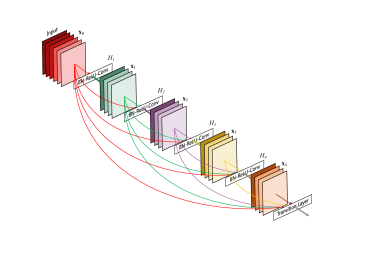

#! https://zhuanlan.zhihu.com/p/574029912
# [Notes][Vision][CNN] DenseNet

* url: https://arxiv.org/abs/1608.06993
* Title: Densely Connected Convolutional Networks
* Year: 25 Aug `2016`
* Authors: Gao Huang, Zhuang Liu, Laurens van der Maaten, Kilian Q. Weinberger
* Institutions: [Cornell University], [Tsinghua University], [Facebook AI Research]
* Abstract: Recent work has shown that convolutional networks can be substantially deeper, more accurate, and efficient to train if they contain shorter connections between layers close to the input and those close to the output. In this paper, we embrace this observation and introduce the Dense Convolutional Network (DenseNet), which connects each layer to every other layer in a feed-forward fashion. Whereas traditional convolutional networks with L layers have L connections - one between each layer and its subsequent layer - our network has L(L+1)/2 direct connections. For each layer, the feature-maps of all preceding layers are used as inputs, and its own feature-maps are used as inputs into all subsequent layers. DenseNets have several compelling advantages: they alleviate the vanishing-gradient problem, strengthen feature propagation, encourage feature reuse, and substantially reduce the number of parameters. We evaluate our proposed architecture on four highly competitive object recognition benchmark tasks (CIFAR-10, CIFAR-100, SVHN, and ImageNet). DenseNets obtain significant improvements over the state-of-the-art on most of them, whilst requiring less computation to achieve high performance. Code and pre-trained models are available at [this https URL](https://github.com/liuzhuang13/DenseNet).

----------------------------------------------------------------------------------------------------

## Summary of Main Contributions

* Dense connections.

----------------------------------------------------------------------------------------------------

## 1. Introduction

<figure align="center">
    
    <figcaption> Figure 1: A 5-layer dense block with a growth rate of k=4. Each layer takes all preceding feature-maps as input. </figcaption>
</figure>

> In this paper, we propose an architecture that distills this insight into a simple connectivity pattern: to ensure maximum information flow between layers in the network, we connect all layers (with matching feature-map sizes) directly with each other. To preserve the feed-forward nature, each layer obtains additional inputs from all preceding layers and passes on its own feature-maps to all subsequent layers.

> Crucially, in contrast to ResNets, we never combine features through summation before they are passed into a layer; instead, we combine features by concatenating them.

> A possibly counter-intuitive effect of this dense connectivity pattern is that it requires fewer parameters than traditional convolutional networks, as there is no need to re-learn redundant feature maps.

> Traditional feed-forward architectures can be viewed as algorithms with a `state`, which is passed on from layer to layer. Each layer reads the state from its preceding layer and writes to the subsequent layer. It changes the state but also passes on information that needs to be preserved.

> Our proposed DenseNet architecture explicitly differentiates between information that is added to the network and information that is preserved.

> DenseNet layers are very narrow (e.g., 12 feature-maps per layer), adding only a small set of feature-maps to the “collective knowledge” of the network and keep the remaining feature-maps unchanged—and the final classifier makes a decision based on all feature-maps in the network.

> Besides better parameter efficiency, one big advantage of DenseNets is their improved flow of information and gradients throughout the network, which makes them easy to train. Each layer has direct access to the gradients from the loss function and the original input signal, leading to an implicit deep supervision [20]. This helps training of deeper network architectures.

> Further, we also observe that dense connections have a regularizing effect, which reduces overfitting on tasks with smaller training set sizes.

## 2. Related Work

## 3. DenseNets

**Growth rate**

Notations:
* Let $k_{0} \in \mathbb{Z}_{++}$ denote the number of channels of the input feature map.
* Let $k \in \mathbb{Z}_{++}$ denote the number of convolutional kernels in each layer.

Then the number of channels of the output feature map of the $\ell$-th layer is $k_{0} + (\ell-1) \times k$.

> We show in Section 2 that a relatively small growth rate is sufficient to obtain state-of-the-art results on the datasets that we tested on.

> One explanation for this is that each layer has access to all the preceding feature-maps in its block and, therefore, to the network’s `"collective knowledge"`. One can view the feature-maps as the `global state` of the network.

> Each layer adds $k$ feature-maps of its own to this state. The growth rate regulates how much new information each layer contributes to the global state.

> The global state, once written, can be accessed from everywhere within the network and, unlike in traditional network architectures, there is no need to replicate it from layer to layer.

**Bottleneck layers**

**Compression**

> To further improve model compactness, we can reduce the number of feature-maps at transition layers. If a dense block contains $m$ feature-maps, we let the following transition layer generate $\lfloor\theta m\rfloor$ output feature-maps, where $0 \leq \theta \leq 1$ is referred to as the `compression factor`.

## 5. Discussion

**Model compactness**

> As a direct consequence of the input concatenation, the feature maps learned by any of the DenseNet layers can be accessed by all subsequent layers. This encourages feature reuse throughout the network, and leads to more compact models.

**Implicit Deep Supervision**

> One explanation for the improved accuracy of dense convolutional networks may be that individual layers receive additional supervision from the loss function through the shorter connections. One can interpret DenseNets to perform a kind of “deep supervision”.

> DenseNets perform a similar deep supervision in an implicit fashion: a single classifier on top of the network provides direct supervision to all layers through at most two or three transition layers.

**Stochastic vs. deterministic connection**

> There is an interesting connection between dense convolutional networks and stochastic depth regularization of residual networks [13]. In stochastic depth, layers in residual networks are randomly dropped, which creates direct connections between the surrounding layers. As the pooling layers are never dropped, the network results in a similar connectivity pattern as DenseNet: There is a small probability for any two layers, between the same pooling layers, to be directly connected—if all intermediate layers are randomly dropped. Although the methods are ultimately quite different, the DenseNet interpretation of stochastic depth may provide insights into the success of this regularizer.

**Feature Reuse**

> By design, DenseNets allow layers access to feature maps from all of its preceding layers (although sometimes through transition layers).

<figure align="center">
    
    <figcaption> Figure 5: The average absolute filter weights of convolutional layers in a trained DenseNet. The color of pixel $(s, \ell)$ encodes the average L1 norm (normalized by the number of input feature maps) of the weights connecting convolutional layer s to layer $\ell$ within a dense block. The three columns highlighted by black rectangles correspond to the two transition layers and the classification layer. The first row encodes those weights connected to the input layer of the dense block. </figcaption>
</figure>

Experimental Conclusions:

> 1. All layers spread their weights over many inputs within the same block. This indicates that features extracted by very early layers are, indeed, directly used by deep layers throughout the same dense block.
> 2. The weights of the transition layers also spread their weight across all layers within the preceding dense block, indicating information flow from the first to the last layers of the DenseNet through few indirections.
> 3. The layers within the second and third dense block consistently assign the least weight to the outputs of the transition layer (the top row of the triangles), indicating that the transition layer outputs many redundant features (with low weight on average). This is in keeping with the strong results of DenseNet-BC where exactly these outputs are compressed.
> 4. Although the final classification layer, shown on the very right, also uses weights across the entire dense block, there seems to be a concentration towards final feature-maps, suggesting that there may be some more high-level features produced late in the network.

## 6. Conclusion

----------------------------------------------------------------------------------------------------

## References

* Huang, Gao, et al. "Densely connected convolutional networks." *Proceedings of the IEEE conference on computer vision and pattern recognition*. 2017.

## Further Reading

* [11] [ResNet](https://zhuanlan.zhihu.com/p/570072614)
* [13] Stochastic Depth
* [17] FractalNet
* [19] LeNet
* [28] [VGGNet](https://zhuanlan.zhihu.com/p/563314926)
* [33] [Highway Networks](https://zhuanlan.zhihu.com/p/554615809)
