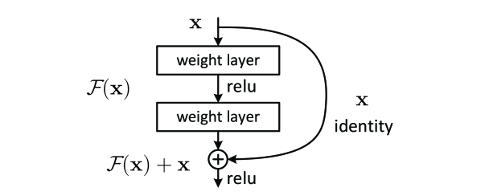
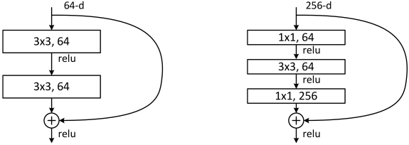

#! https://zhuanlan.zhihu.com/p/570072614
# [Notes][Vision][CNN] ResNet

* url: https://arxiv.org/abs/1512.03385
* Title: Deep Residual Learning for Image Recognition
* Year: 10 Dec `2015`
* Authors: Kaiming He, Xiangyu Zhang, Shaoqing Ren, Jian Sun
* Institutions: [Microsoft Research]
* Abstract: Deeper neural networks are more difficult to train. We present a residual learning framework to ease the training of networks that are substantially deeper than those used previously. We explicitly reformulate the layers as learning residual functions with reference to the layer inputs, instead of learning unreferenced functions. We provide comprehensive empirical evidence showing that these residual networks are easier to optimize, and can gain accuracy from considerably increased depth. On the ImageNet dataset we evaluate residual nets with a depth of up to 152 layers---8x deeper than VGG nets but still having lower complexity. An ensemble of these residual nets achieves 3.57% error on the ImageNet test set. This result won the 1st place on the ILSVRC 2015 classification task. We also present analysis on CIFAR-10 with 100 and 1000 layers. The depth of representations is of central importance for many visual recognition tasks. Solely due to our extremely deep representations, we obtain a 28% relative improvement on the COCO object detection dataset. Deep residual nets are foundations of our submissions to ILSVRC & COCO 2015 competitions, where we also won the 1st places on the tasks of ImageNet detection, ImageNet localization, COCO detection, and COCO segmentation.

----------------------------------------------------------------------------------------------------

## 1. Introduction

The Problem with Deep Networks

> When deeper networks are able to start converging, a degradation problem has been exposed: with the network depth increasing, accuracy gets saturated (which might be unsurprising) and then degrades rapidly.

> Unexpectedly, such degradation is not caused by overfitting, and adding more layers to a suitably deep model leads to higher training error, as reported in [11, 42] and thoroughly verified by our experiments.

> The degradation (of training accuracy) indicates that not all systems are similarly easy to optimize.

> Let us consider a shallower architecture and its deeper counterpart that adds more layers onto it. There exists a solution by construction to the deeper model: the added layers are identity mapping, and the other layers are copied from the learned shallower model. The existence of this constructed solution indicates that a deeper model should produce no higher training error than its shallower counterpart. But experiments show that our current solvers on hand are unable to find solutions that are comparably good or better than the constructed solution (or unable to do so in feasible time).

Our Approach

> Instead of hoping each few stacked layers directly fit a desired underlying mapping, we explicitly let these layers fit a residual mapping.

> Formally, denoting the desired underlying mapping as $\mathcal{H}(\textbf{x})$, we let the stacked nonlinear layers fit another mapping of $\mathcal{F}(\textbf{x}) := \mathcal{H}(\textbf{x}) - \textbf{x}$. The original mapping is recast into $\mathcal{F}(\textbf{x}) + \textbf{x}$. We hypothesize that it is easier to optimize the residual mapping than to optimize the original, unreferenced mapping. To the extreme, if an identity mapping were optimal, it would be easier to push the residual to zero than to fit an identity mapping by a stack of nonlinear layers.

<figure align="center">
    
    <figcaption> Figure 2. Residual learning: a building block. </figcaption>
</figure>

> We show that:
> 1. Our extremely deep residual nets are easy to optimize, but the counterpart “plain” nets (that simply stack layers) exhibit higher training error when the depth increases;
> 2. Our deep residual nets can easily enjoy accuracy gains from greatly increased depth, producing results substantially better than previous networks.

## 2. Related Work

**Residual Representations**

**Shortcut Connections**

> Our formulation always learns residual functions; our identity shortcuts are never closed, and all information is always passed through, with additional residual functions to be learned.

## 3. Deep Residual Learning

> Although both forms should be able to asymptotically approximate the desired functions (as hypothesized), the ease of learning might be different.

> As we discussed in the introduction, if the added layers can be constructed as identity mappings, a deeper model should have training error no greater than its shallower counterpart. The degradation problem suggests that the solvers might have difficulties in approximating identity mappings by multiple nonlinear layers. With the residual learning reformulation, if identity mappings are optimal, the solvers may simply drive the weights of the multiple nonlinear layers toward zero to approach identity mappings.

> In real cases, it is unlikely that identity mappings are optimal, but our reformulation may help to precondition the problem. If the optimal function is closer to an identity mapping than to a zero mapping, it should be easier for the solver to find the perturbations with reference to an identity mapping, than to learn the function as a new one. We show by experiments (Fig. 7) that the learned residual functions in general have small responses, suggesting that identity mappings provide reasonable preconditioning.

### 3.2. Identity Mapping by Shortcuts

> The dimensions of $\textbf{x}$ and $\mathcal{F}$ must be equal in Eqn.(1). If this is not the case (e.g., when changing the input/output channels), we can perform a linear projection $W_{s}$ by the shortcut connections to match the dimensions.

> The form of the residual function $\mathcal{F}$ is flexible. Experiments in this paper involve a function $\mathcal{F}$ that has two or three layers (Fig. 5), while more layers are possible.

> But if $\mathcal{F}$ has only a single layer, Eqn.(1) is similar to a linear layer: $\textbf{y} = W_{1}\textbf{x} + \textbf{x}$, for which we have not observed advantages.

### 3.3. Network Architectures

**Plain Network**

**Residual Network**

> When the dimensions increase (dotted line shortcuts in Fig. 3), we consider two options:
> 1. The shortcut still performs identity mapping, with extra zero entries padded for increasing dimensions. This option introduces no extra parameter;
> 2. The projection shortcut in Eqn.(2) is used to match dimensions (done by 1x1 convolutions).

> For both options, when the shortcuts go across feature maps of two sizes, they are performed with a stride of 2.

### 3.4. Implementation

## 4. Experiments

### 4.1. ImageNet Classification

**Plain Networks**

**Residual Networks**

**Identity vs. Projection Shortcuts**

> In Table 3 we compare three options:
> 1. zero-padding shortcuts are used for increasing dimensions, and all shortcuts are parameter-free (the same as Table 2 and Fig. 4 right);
> 2. projection shortcuts are used for increasing dimensions, and other shortcuts are identity; and
> 3. all shortcuts are projections.

All three options performed similarly.
So don't use the third one.

**Deeper Bottleneck Architectures**

<figure align="center">
    
    <figcaption>
        Figure 5. A deeper residual function $\mathcal{F}$ for ImageNet.
        Left: a building block (on 56x56 feature maps) as in Fig. 3 for ResNet34.
        Right: a "bottleneck" building block for ResNet-50/101/152.
    </figcaption>
</figure>

> For each residual function $\mathcal{F}$, we use a stack of 3 layers instead of 2 (Fig. 5). The three layers are 1x1, 3x3, and 1x1 convolutions, where the 1x1 layers are responsible for reducing and then increasing (restoring) dimensions, leaving the 3x3 layer a bottleneck with smaller input/output dimensions.

> The parameter-free identity shortcuts are particularly important for the bottleneck architectures. If the identity shortcut in Fig. 5 (right) is replaced with projection, one can show that the time complexity and model size are doubled, as the shortcut is connected to the two high-dimensional ends. So identity shortcuts lead to more efficient models for the bottleneck designs.

**Comparisons with State-of-the-art Methods**

### 4.2. CIFAR-10 and Analysis

----------------------------------------------------------------------------------------------------

## References

* He, Kaiming, et al. "Deep residual learning for image recognition." *Proceedings of the IEEE conference on computer vision and pattern recognition*. 2016.

## Further Reading

* [7] Fast R-CNN
* [8] R-CNN
* [10] Maxout
* [12] Spatial Pyramid Pooling (SPP)
* [16] Inception-v2/Batch Normalization
* [21] [AlexNet](https://zhuanlan.zhihu.com/p/565285454)
* [24] Deeply-Supervised Nets (DSN)
* [25] Network In Network (NIN)
* [27] [Fully Convolutional Networks (FCN)](https://zhuanlan.zhihu.com/p/561031110)
* [32] Faster R-CNN
* [35] FitNet
* [40] OverFeat
* [41] [VGGNet](https://zhuanlan.zhihu.com/p/563314926)
* [42] [Highway Networks](https://zhuanlan.zhihu.com/p/554615809)
* [44] [Inception-v1/GoogLeNet](https://zhuanlan.zhihu.com/p/564141144)
