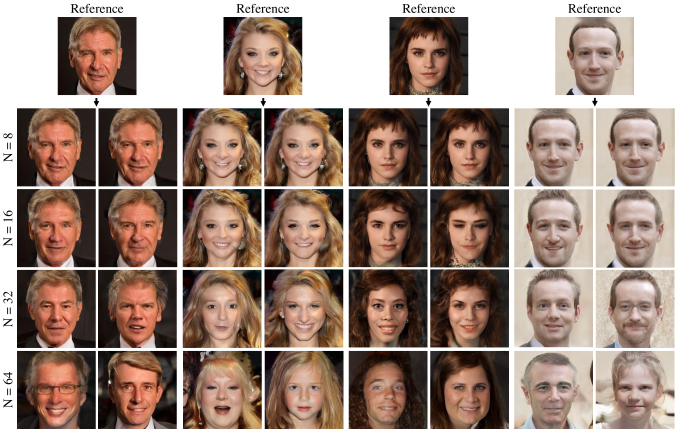
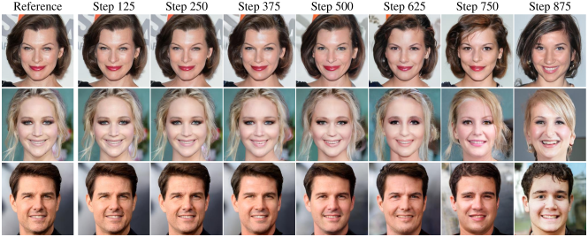
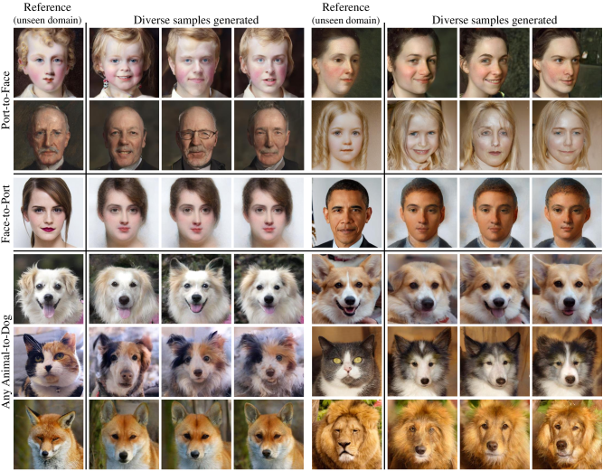

# [Notes][Vision][Diffusion] ILVR <!-- omit in toc -->

* urls: [[abs](https://arxiv.org/abs/2108.02938)]
    [[pdf](https://arxiv.org/pdf/2108.02938.pdf)]
    [[vanity](https://www.arxiv-vanity.com/papers/2108.02938/)]
    * Title: ILVR: Conditioning Method for Denoising Diffusion Probabilistic Models
    * Year: 06 Aug `2021`
    * Authors: Jooyoung Choi, Sungwon Kim, Yonghyun Jeong, Youngjune Gwon, Sungroh Yoon
    * Abstract: Denoising diffusion probabilistic models (DDPM) have shown remarkable performance in unconditional image generation. However, due to the stochasticity of the generative process in DDPM, it is challenging to generate images with the desired semantics. In this work, we propose Iterative Latent Variable Refinement (ILVR), a method to guide the generative process in DDPM to generate high-quality images based on a given reference image. Here, the refinement of the generative process in DDPM enables a single DDPM to sample images from various sets directed by the reference image.

## Table of Contents <!-- omit in toc -->

- [Summary of Main Contributions](#summary-of-main-contributions)
- [1. Introduction](#1-introduction)
- [2. Background](#2-background)
- [3. Method](#3-method)
  - [3.1. Iterative Latent Variable Refinement](#31-iterative-latent-variable-refinement)
  - [3.2. Reference selection and user controllability](#32-reference-selection-and-user-controllability)
- [4. Experiments and Applications](#4-experiments-and-applications)
- [5. Related Work](#5-related-work)
- [6. Conclusion](#6-conclusion)
- [References](#references)
- [See Also](#see-also)

----------------------------------------------------------------------------------------------------

## Summary of Main Contributions

----------------------------------------------------------------------------------------------------

## 1. Introduction

> There are mainly two approaches to control generative models to generate images as desired:
> 1. one is by designing the conditional generative models for the desired purpose,
> 2. and the other is by leveraging well-performed unconditional generative models.

**Problem Observed**

> Samples obtained from the DDPM depend on the
initial state of the simple distribution and each transition.
However, it is challenging to control DDPM to generate
images with desired semantics, since the stochasticity of
transitions generates images with inconsistent high-level semantics, even from the same initial state.

> In this work, we propose a learning-free method, iterative latent variable refinement (ILVR), to condition the generation process in well-performing unconditional DDPM.
Each transition in the generation process is refined utilizing
a given reference image. By matching each latent variable,
ILVR ensures the given condition in each transition thus enables sampling from a conditional distribution. Thus, ILVR
generates high-quality images sharing desired semantics.

## 2. Background

**DDPM - Forward Process**

> Each step in the forward process is a Gaussian translation.
> $$q(x_{t} | x_{t-1}) := \mathcal{N}(x_{t}; \sqrt{1-\beta_{t}}x_{t-1}, \beta_{t}I), \tag{1}$$
> where $[\beta_{1}, ..., \beta_{T}]$ is a fixed variance schedule.

> Given clean data $x_{0}$, sampling of $x_{t}$ is expressed in a closed form:
> $$q(x_{t} | x_{0}) := \mathcal{N}(x_{t}; \sqrt{\bar{\alpha}_{t}}x_{0}, (1-\bar{\alpha}_{t})I), \tag{2}$$
> where $\alpha_{t} := 1-\beta_{t}$ and $\bar{\alpha}_{t} := \prod_{s=1}^{t}\alpha_{s}$.

> Therefore, $x_{t}$ can be expressed as a linear combination of $x_{0}$ and $\epsilon$:
> $$x_{t} = \sqrt{\bar{\alpha}_{t}}x_{0} + \sqrt{1-\bar{\alpha}_{t}}\epsilon, \tag{3}$$
> where $\epsilon \sim \mathcal{N}(0, I)$ has the same dimensionality as data $x_{0}$ and latent variables $x_{1}$, ..., $x_{T}$.

**DDPM - Generative Process**

> The generative (or reverse) process has the same functional form [39] as the forward process, and it is expressed as a Gaussian transition with learned mean and fixed variance [14]:
> $$p_{\theta}(x_{t-1} | x_{t}) = \mathcal{N}(x_{t-1}; \mu_{\theta}(x_{t}, t), \sigma_{t}^{2}I). \tag{4}$$

> Further, by decomposing $\mu_{\theta}$ into a linear combination of $x_{t}$ and the noise approximator $\epsilon_{\theta}$, the generative process is expressed as:
> $$x_{t-1} = \frac{1}{\sqrt{\alpha_{t}}}\bigg(x_{t} - \frac{1-\alpha_{t}}{\sqrt{1-\bar{\alpha}_{t}}}\epsilon_{\theta}(x_{t}, t)\bigg) + \sigma_{t}z, \tag{5}$$
> where $z \sim \mathcal{N}(0, I)$, which suggests that each generation step is stochastic.
> $\epsilon_{\theta}$ represents a neural network with the same input and output dimensions and the noise predicted by the neural network $\epsilon_{\theta}$ in each step is used for the denoising process in Eq. 5.

## 3. Method

### 3.1. Iterative Latent Variable Refinement

> In this section, we introduce Iterative Latent Variable Refinement (ILVR), a method of conditioning the generative
process of the unconditional DDPM model to generate images that share high-level semantics from given reference
images. For this purpose, we sample images from the conditional distribution $p(x_{0} | c)$ with the condition $c$:
> $$\begin{align*}
    & p_{\theta}(x_{0} | c) = \int p_{\theta}(x_{0:T} | c)dx_{1:T}, \text{ where }\\
    & p_{\theta}(x_{0:T} | c) = p(x_{T})\prod_{t=1}^{T}p_{\theta}(x_{t-1} | x_{t}, c).
    \end{align*} \tag{6}$$
> Each transition $p_{\theta}(x_{t-1} | x_{t}, c)$ of the generative process depends on the condition $c$.

> Our ILVR provides condition $c$ to unconditional transition $p_{\theta}(x_{t-1} | x_{t})$ without additional learning or models. Specifically, we refine each unconditional
transition with a downsampled reference image.

> Let $\phi_{N}$ denote a linear low-pass filtering operation, a sequence of downsampling and upsampling by a factor of $N$, therefore maintaining dimensionality of the image.

> Utilizing the forward process $q(x_{t} | x_{0})$ of Eq. 3 and the linear property of $\phi_{N}$, each Markov transition under the condition $c$ is approximated as follows:
> $$p_{\theta}(x_{t-1} | x_{t}, c) \approx p_{\theta}(x_{t-1} | x_{t}, \phi_{N}(x_{t-1}) = \phi_{N}(y_{t-1})), \tag{7}$$

> To ensure the local condition in each transition, we first use DDPM to compute the unconditional proposal distribution of $x_{t-1}'$ from $x_{t}$. Then, since operation $\phi$ maintains dimensionality, we refine the proposal distribution by matching $\phi(x_{t-1}')$ of the proposal $x_{t-1}'$ with that of $y_{t-1}$ as follows:
> $$\begin{align*}
    & x_{t-1}' \sim p_{\theta}(x_{t-1}' | x_{t}), \\
    & x_{t-1} = \phi(y_{t-1}) + (I-\phi)(x_{t-1}').
    \end{align*} \tag{8}$$

> By matching latent variables following Eq. 8, ILVR ensures local condition in Eq. 7, thus enables conditional generation with unconditional DDPM.

### 3.2. Reference selection and user controllability

> Let $\mu$ be the set of images that an unconditional DDPM can generate. Our method enables sampling from a conditional distribution with a given reference image $y$. In other
words, we sample images from a subset of $\mu$, which is directed by the reference image.

> To extend our method to various applications, we investigate
> 1. minimum requirement on reference image selection and
> 2. user controllability on reference directed subset, which defines semantic similarity to the reference.

> **Definition.**
> We denote the directed subset as:
> $$R_{N}(y) := \{x: \phi_{N}(x) = \phi_{N}(y)\}, \tag{9}$$
> representing the set of images $x \in \mathbb{R}^{H \times H}$ which are equivalent to the downsampled reference image $y$.

> **Definition.**
> We consider a range of conditioning steps by extending the above notation:
> $$R_{N, (a, b)}(y) := \{x: \phi_{N}(x_{t}) = \phi_{N}(y_{t}), t \in [b, a]\}, \tag{10}$$
> where $R_{N, (a, b)}(y)$ represents the distribution of images matching latent variables (line9 lf Alg. 1) in steps $b$ to $a$.

> **Property 1.** Reference image can be any image selected from the set
> $$Y := \{y: \phi_{N}(y) = \phi_{N}(x), x \in \mu\}, \tag{11}$$
> the reference image only needs to match the low-resolution space of learned data distribution. Even reference images from unseen data domains are possible. Thus, we can select a reference from unseen data domains and perform multidomain image translation, as demonstrated in Section. 4.2.

> **Property 2.** Considering downsampling factors $N$ and $M$ where $N \leq M$
> $$R_{N} \subseteq R_{M} \subseteq \mu, \tag{12}$$
> which suggests that higher factors correspond to broader image subsets.

As higher factor $N$ enables sampling from broader set of images, sampled images are more diverse and exhibit lower semantic similarity to the reference.

Samples obtained from higher factor $N$ share coarse features of the reference, while samples from lower N share also finer features.

> **Property 3.**  Limiting the range of conditioning steps enables sampling from a broader subset, while sampling from
> learned image distribution is still guaranteed.
> $$R_{N} \subseteq R_{N, (T, k)} \subseteq \mu. \tag{13}$$

Limiting the range of conditioning steps enables sampling from a broader subset, while sampling from learned image distribution is still guaranteed.

## 4. Experiments and Applications

<figure align="center">
    
    <figcaption>
        Figure 4: Generating from various downsampling factors. Samples obtained from high factor (N=64) are diverse, only bringing coarse information (color scheme) from reference images. Samples from middle factor (N=32) brought middle level semantics (facial features) while samples from low factors (N=16,8) are highly similar to the reference.
    </figcaption>
</figure>

<figure align="center">
    
    <figcaption>
        Figure 5: Generating from various conditioning ranges. Samples are generated with ILVR on steps from 1000 to 125, from 1000 to 250, and so on. Samples start to deviate from the reference images with range narrower than step 1000-500.
    </figcaption>
</figure>

<figure align="center">
    
    <figcaption>
        Figure 6: Image translation from various source domains. Row1-2: portrait to face. Row3: face to portrait. Row4-6: any animal (dog, cat, wildlife) to dog. Our method enables translation from any source domains, unseen in the training phase. Moreover, our method generate diverse samples.
    </figcaption>
</figure>

## 5. Related Work

## 6. Conclusion

----------------------------------------------------------------------------------------------------

## References

## See Also

