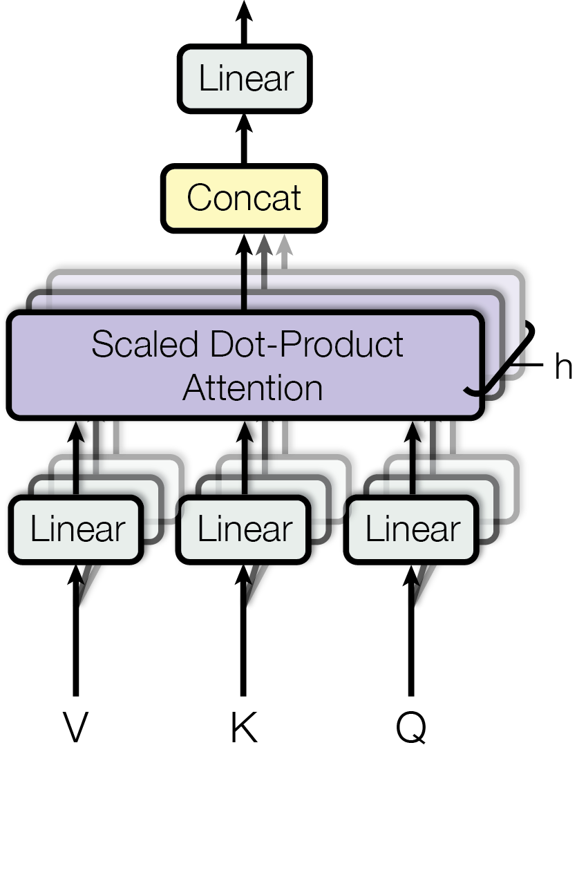

#! https://zhuanlan.zhihu.com/p/566630656
# [Notes][Vision][Transformer] Attention Is All You Need

* url: https://arxiv.org/abs/1706.03762
* Title: Attention Is All You Need
* Year: 12 Jun `2017`
* Authors: Ashish Vaswani, Noam Shazeer, Niki Parmar, Jakob Uszkoreit, Llion Jones, Aidan N. Gomez, Lukasz Kaiser, Illia Polosukhin
* Institutions: [Google Brain], [Google Research], [University of Toronto]
* Abstract: The dominant sequence transduction models are based on complex recurrent or convolutional neural networks in an encoder-decoder configuration. The best performing models also connect the encoder and decoder through an attention mechanism. We propose a new simple network architecture, the Transformer, based solely on attention mechanisms, dispensing with recurrence and convolutions entirely. Experiments on two machine translation tasks show these models to be superior in quality while being more parallelizable and requiring significantly less time to train. Our model achieves 28.4 BLEU on the WMT 2014 English-to-German translation task, improving over the existing best results, including ensembles by over 2 BLEU. On the WMT 2014 English-to-French translation task, our model establishes a new single-model state-of-the-art BLEU score of 41.8 after training for 3.5 days on eight GPUs, a small fraction of the training costs of the best models from the literature. We show that the Transformer generalizes well to other tasks by applying it successfully to English constituency parsing both with large and limited training data.

----------------------------------------------------------------------------------------------------

## Summary of Main Contributions

* Multi-Head Self-Attention
* Techniques used: residual dropout, attention dropout, label smoothing.

----------------------------------------------------------------------------------------------------

## 1 Introduction

## 2 Background

> Self-attention, sometimes called intra-attention is an attention mechanism relating different positions of a single sequence in order to compute a representation of the sequence.

## 3 Model Architecture

<figure align="center">
    
    <figcaption> Figure 1: The Transformer - model architecture. </figcaption>
</figure>

> Most competitive neural sequence transduction models have an encoder-decoder structure. Here, the encoder maps an input sequence of symbol representations $\textbf{x} = (x_{1}, ..., x_{n})$ to a sequence of continuous representations $\textbf{z} = (z_{1}, ..., z_{n})$. Given $\textbf{z}$, the decoder then generates an output sequence $\textbf{y} = (y_{1}, ..., y_{m})$ of symbols one element at a time. At each step the model is auto-regressive, consuming the previously generated symbols as additional input when generating the next.

> The Transformer follows this overall architecture using stacked self-attention and point-wise, fully connected layers for both the encoder and decoder.

### 3.1 Encoder and Decoder Stacks

**Encoder**

> The encoder is composed of a stack of $N = 6$ identical layers. Each layer has two sub-layers.
> 1. The first is a multi-head self-attention mechanism, and
> 2. the second is a simple, position-wise fully connected feed-forward network.

> We employ a `residual connection` around each of the two sub-layers, followed by `layer normalization`.

> That is, the output of each sub-layer is $\operatorname{LayerNorm}(x + \operatorname{Sublayer}(x))$, where $\operatorname{Sublayer}(x)$ is the function implemented by the sub-layer itself. To facilitate these residual connections, all sub-layers in the model, as well as the embedding layers, produce outputs of dimension $d_{\text{model}} = 512$.

**Decoder**

> The decoder is also composed of a stack of $N = 6$ identical layers. In addition to the two sub-layers in each encoder layer, the decoder inserts a third sub-layer, which performs multi-head attention over the output of the encoder stack.

> Similar to the encoder, we employ `residual connections` around each of the sublayers, followed by `layer normalization`.

> We also modify the self-attention sub-layer in the decoder stack to prevent positions from attending to subsequent positions. This masking, combined with fact that the output embeddings are offset by one position, ensures that the predictions for position $i$ can depend only on the known outputs at positions less than $i$.

### 3.2 Attention

> An attention function can be described as mapping a query and a set of key-value pairs to an output, where the query, keys, values, and output are all vectors.

> The output is computed as a weighted sum of the `values`, where the weight assigned to each value is computed by a compatibility function of the `query` with the corresponding `key`.

**Scaled Dot-Product Attention**

> The input consists of queries and keys of dimension $d_{k}$, and values of dimension $d_{v}$. We compute the dot products of the query with all keys, divide each by $\sqrt{d_{k}}$, and apply a softmax function to obtain the weights on the values.

> Two most commonly used attention functions are `additive` attention, and dot-product (`multiplicative`) attention. Dot-product attention is identical to our algorithm, except for the scaling factor of $\frac{1}{\sqrt{d_{k}}}$. Additive attention computes the compatibility function using a feed-forward network with a single hidden layer. While the two are similar in theoretical complexity, dot-product attention is much faster and more space-efficient in practice, since it can be implemented using highly optimized matrix multiplication code.

> While for small values of $d_{k}$ the two mechanisms perform similarly, additive attention outperforms dot product attention without scaling for larger values of $d_{k}$. We suspect that for large values of $d{k}$, the dot products grow large in magnitude, pushing the softmax function into regions where it has extremely small gradients. To counteract this effect, we scale the dot products by $\frac{1}{d_{k}}$.

Notations:
* Let $d_{k} \in \mathbb{Z}_{++}$ denote the dimension of the queries and keys.
* Let $d_{v} \in \mathbb{Z}_{++}$ denote the dimension of the values.
* Let $m \in \mathbb{Z}_{++}$ denote the number of queries.
* Let $n \in \mathbb{Z}_{++}$ denote the number of keys and values.
* Let $Q \in \mathbb{R}^{m \times d_{k}}$ denote the matrix of queries.
* Let $K \in \mathbb{R}^{n \times d_{k}}$ denote the matrix of keys.
* Let $V \in \mathbb{R}^{n \times d_{v}}$ denote the matrix of values.

Then the Scaled Dot-Product Attention layer $\operatorname{Attention}: \mathbb{R}^{m \times d_{k}} \oplus \mathbb{R}^{n \times d_{k}} \oplus \mathbb{R}^{n \times d_{v}} \to \mathbb{R}^{m \times d_{v}}$ is given by

$$\operatorname{Attention}(Q, K, V) = \operatorname{softmax}\bigg(\frac{QK^{\top}}{\sqrt{d_{k}}}\bigg)V.$$

**Multi-Head Attention**

<figure align="center">
    
    
    <figcaption> Figure 2: (left) Scaled Dot-Product Attention. (right) Multi-Head Attention consists of several attention layers running in parallel.
 </figcaption>
</figure>

> Instead of performing a single attention function with $d_{\text{model}}$-dimensional keys, values, and queries, we found it beneficial to linearly project the queries, keys, and values $h$ times with different, learned linear projections to $d_{k}$, $d_{k}$, and $d_{v}$ dimensions, respectively. On each of these projected versions of queries, keys, and values we then perform the attention function in parallel, yielding $d_{v}$-dimensional output values. These are concatenated and once again projected, resulting in the final values.

> Multi-head attention allows the model to jointly attend to information from different representation subspaces at different positions. With a single attention head, averaging inhibits this.

Notations:
* Let $h \in \mathbb{Z}_{++}$ denote the number of heads.
* Let $Q \in \mathbb{R}^{m \times d_{\text{model}}}$ denote the matrix of queries.
* Let $K \in \mathbb{R}^{n \times d_{\text{model}}}$ denote the matrix of keys.
* Let $V \in \mathbb{R}^{n \times d_{\text{model}}}$ denote the matrix of values.
* Let $W_{Q}^{(i)} \in \mathbb{R}^{d_{\text{model}} \times d_{k}}$ denote the projection operation for $Q$, for $i \in \{1, ..., h\}$.
* Let $W_{K}^{(i)} \in \mathbb{R}^{d_{\text{model}} \times d_{k}}$ denote the projection operation for $K$, for $i \in \{1, ..., h\}$.
* Let $W_{V}^{(i)} \in \mathbb{R}^{d_{\text{model}} \times d_{v}}$ denote the projection operation for $V$, for $i \in \{1, ..., h\}$.
* Let $W^{O} \in \mathbb{R}^{hd_{v} \times d_{\text{model}}}$ denote the projection operation on the heads.

Then the Multi-Head Attention layer $\text{MultiHead}: \mathbb{R}^{m \times d_{\text{model}}} \oplus \mathbb{R}^{n \times d_{\text{model}}} \oplus \mathbb{R}^{n \times d_{\text{model}}} \to \mathbb{R}^{m \times d_{\text{model}}}$ is given by

$$\operatorname{MultiHeadAttention}(Q, K, V) := \operatorname{Concatenate}(\text{head}_{1}, ..., \text{head}_{h})W^{O}$$

where $\forall i \in \{1, ..., h\}$, $\text{head}_{i} \in \mathbb{R}^{m \times d_{v}}$ is given by
$$\text{head}_{i} := \operatorname{Attention}(QW_{Q}^{(i)}, KW_{K}^{(i)}, VW_{V}^{(i)}).$$

> In this work we employ $h = 8$ parallel attention layers, or heads. For each of these we use $d_{k} = d_{v} = d_{\text{model}} / h = 64$. Due to the reduced dimension of each head, the total computational cost is similar to that of single-head attention with full dimensionality.

**Applications of Attention in our Model**

> The Transformer uses multi-head attention in three different ways:
> 1. In "encoder-decoder attention" layers, the queries come from the previous decoder layer, and the memory keys and values come from the output of the encoder. This allows every position in the decoder to attend over all positions in the input sequence. This mimics the typical encoder-decoder attention mechanisms in sequence-to-sequence models.
> 2. The encoder contains self-attention layers. In a self-attention layer all of the keys, values, and queries come from the same place, in this case, the output of the previous layer in the encoder. Each position in the encoder can attend to all positions in the  previous layer of the encoder.
> 3. Similarly, self-attention layers in the decoder allow each position in the decoder to attend to all positions in the decoder up to and including that position. We need to prevent leftward information flow in the decoder to preserve the auto-regressive property. We implement this inside of scaled dot--product attention by masking out (setting to $-\infty$) all values in the input of the softmax which correspond to illegal connections.

### 3.3 Position-wise Feed-Forward Networks

> In addition to attention sub-layers, each of the layers in our encoder and decoder contains a fully connected feed-forward network, which is applied to each position separately and identically. This consists of two linear transformations with a ReLU activation in between.

Notations:
* Let $W_{1} \in \mathbb{R}^{d_{\text{model}} \times d_{ff}}$ denote the weights of the first fully connected layer.
* Let $b_{1} \in \mathbb{R}^{m \times d_{ff}}$ denote the bias of the first fully connected layer.
* Let $W_{2} \in \mathbb{R}^{d_{ff} \times d_{\text{model}}}$ denote the weights of the second fully connected layer.
* Let $b_{2} \in \mathbb{R}^{m \times d_{\text{model}}}$ denote the bias of the second fully connected layer.

Then the feed-forward network $\operatorname{FFN}: \mathbb{R}^{m \times d_{\text{model}}} \to \mathbb{R}^{m \times d_{\text{model}}}$ is given by
$$\text{FFN}(x) = \max(0, xW_{1} + b_{1})W_{2} + b_{2}.$$

### 3.4 Embeddings and Softmax

> Similarly to other sequence transduction models, we use learned embeddings to convert the input tokens and output tokens to vectors of dimension $d_{\text{model}}$.

> We also use the usual learned linear transformation and softmax function to convert the decoder output to predicted next-token probabilities.

> In our model, we share the same weight matrix between the two embedding layers and the pre-softmax linear transformation, similar to [30].

### 3.5 Positional Encoding

> Since our model contains no recurrence and no convolution, in order for the model to make use of the `order` of the sequence, we must inject some information about the relative or absolute position of the tokens in the sequence.

> To this end, we add "positional encodings" to the input embeddings at the bottoms of the encoder and decoder stacks. The positional encodings have the same dimension $d_{\text{model}}$ as the embeddings, so that the two can be summed.

> In this work, we use sine and cosine functions of different frequencies.

$$\begin{align*}
    \text{PE}(pos, 2i) & = \sin(pos / 10000^{2i/d_{\text{model}}}) \\
    \text{PE}(pos, 2i+1) & = \cos(pos / 10000^{2i/d_{\text{model}}})
    \end{align*}$$
where $pos$ is the position and $i$ is the dimension.

> That is, each dimension of the positional encoding corresponds to a sinusoid. Thee wavelengths form a geometric progression from $2\pi$ to $10000 \cdot 2\pi$.

> We chose this function because we hypothesized it would allow the model to easily learn to attend by relative positions, since for any fixed offset $k$, $\text{PE}(pos + k)$ can be represented as a linear function of $\text{PE}(pos)$.

> We also experimented with using learned positional embeddings [9] instead, and found that the two versions produced nearly identical results (see Table 3 row (E)). We chose the sinusoidal version because it may allow the model to extrapolate to sequence lengths longer than the ones encountered during training.

## 4 Why Self-Attention

> Motivating our use of self-attention we consider three desiderata.
> 1. One is the total computational complexity per layer.
> 2. Another is the amount of computation that can be parallelized, as measured by the minimum number of sequential operations required.
> 3. The third is the path length between long-range dependencies in the network.

Recurrent Neural Networks

> As noted in Table 1, a self-attention layer connects all positions with a constant number of sequentially executed operations, whereas a recurrent layer requires $O(n)$ sequential operations.

> In terms of computational complexity, self-attention layers are faster than recurrent layers when the sequence length n is smaller than the representation dimensionality d, which is most often the case with sentence representations used by state-of-the-art models in machine translations, such as word-piece [38] and byte-pair [31] representations.

Convolutional Neural Networks

> A single convolutional layer with kernel width $k < n$ does not connect all pairs of input and output positions.

> Doing so requires a stack of $O(n/k)$ convolutional layers in the case of `contiguous kernels`, or $O(\log_{k}(n))$ in the case of `dilated convolutions` [18], increasing the length of the longest paths between any two positions in the network.

> Convolutional layers are generally more expensive than recurrent layers, by a factor of k.

> `Separable convolutions` [6], however, decrease the complexity considerably, to $O(k \cdot n \cdot d + n \cdot d^{2} )$. Even with $k = n$, however, the complexity of a separable convolution is equal to the combination of a self-attention layer and a point-wise feed-forward layer, the approach we take in our model.

## 5 Training

### 5.4 Regularization

**Residual Dropout**

> We apply dropout [33] to the output of each sub-layer, before it is added to the sub-layer input and normalized.

> In addition, we apply dropout to the sums of the embeddings and the positional encodings in both the encoder and decoder stacks.

**Attention Dropout**

$$\operatorname{AttentionDropout}(Q, K, V) = \operatorname{dropout}\bigg(\operatorname{softmax}\bigg(\frac{QK^{\top}}{\sqrt{d_{k}}}\bigg)V\bigg).$$

**Label Smoothing**

## 6 Results

## 7 Conclusion

----------------------------------------------------------------------------------------------------

## References

* Vaswani, Ashish, et al. "Attention is all you need." *Advances in neural information processing systems* 30 (2017).

## Further Reading

* [6] [XceptionNet](https://zhuanlan.zhihu.com/p/556794897)
* [33] Dropout
* [36] Inception-v3
