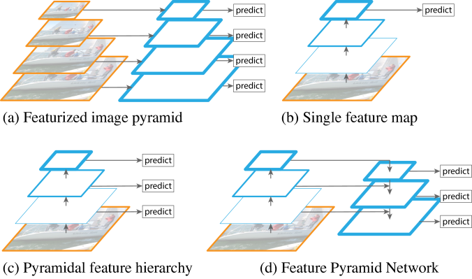
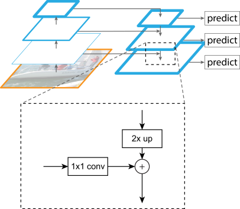

# [Notes][Vision][Detection] FPN

* url: https://arxiv.org/abs/1612.03144
* Title: Feature Pyramid Networks for Object Detection
* Year: 09 Dec `2016`
* Authors: Tsung-Yi Lin, Piotr Dollár, Ross Girshick, Kaiming He, Bharath Hariharan, Serge Belongie
* Institutions: [Facebook AI Research (FAIR)], [Cornell University and Cornell Tech]
* Abstract: Feature pyramids are a basic component in recognition systems for detecting objects at different scales. But recent deep learning object detectors have avoided pyramid representations, in part because they are compute and memory intensive. In this paper, we exploit the inherent multi-scale, pyramidal hierarchy of deep convolutional networks to construct feature pyramids with marginal extra cost. A top-down architecture with lateral connections is developed for building high-level semantic feature maps at all scales. This architecture, called a Feature Pyramid Network (FPN), shows significant improvement as a generic feature extractor in several applications. Using FPN in a basic Faster R-CNN system, our method achieves state-of-the-art single-model results on the COCO detection benchmark without bells and whistles, surpassing all existing single-model entries including those from the COCO 2016 challenge winners. In addition, our method can run at 5 FPS on a GPU and thus is a practical and accurate solution to multi-scale object detection. Code will be made publicly available.

----------------------------------------------------------------------------------------------------

## 1. Introduction

    

> These pyramids are scale-invariant in the sense that an object’s scale change is offset by shifting its level in the pyramid. Intuitively, this property enables a model to detect objects across a large range of scales by scanning the model over both positions and pyramid levels.

Featurized Image Pyramids

> Featurized image pyramids were heavily used in the era of hand-engineered features [5, 25].

> The principle advantage of featurizing each level of an image pyramid is that it produces a multi-scale feature representation in which all levels are semantically strong, including the high-resolution levels.

> Nevertheless, featurizing each level of an image pyramid has obvious limitations.
> * Inference `time` increases considerably (e.g., by four times [11]), making this approach impractical for real applications.
> * Moreover, training deep networks end-to-end on an image pyramid is infeasible in terms of `memory`, and so, if exploited, image pyramids are used only at test time [15, 11, 16, 35], which creates an inconsistency between train/test-time inference.

Pyramidal Feature Hierarchy

> This `in-network feature hierarchy` produces feature maps of different spatial resolutions, but introduces large semantic gaps caused by different depths.

> The high-resolution maps have low-level features that harm their representational capacity for object recognition.

> The Single Shot Detector (SSD) [22] is one of the first attempts at using a ConvNet’s pyramidal feature hierarchy as if it were a featurized image pyramid (Fig. 1(c)).

> Ideally, the SSD-style pyramid would reuse the multi-scale feature maps from different layers computed in the forward pass and thus come free of cost.

> But to avoid using low-level features SSD foregoes reusing already computed layers and instead builds the pyramid starting from high up in the network (e.g., conv4_3 of VGG nets [36]) and then by adding several new layers.

> Thus it misses the opportunity to reuse the higher-resolution maps of the feature hierarchy.

Our Approach: Feature Pyramid Network

> The goal of this paper is to naturally leverage the pyramidal shape of a ConvNet's `feature hierarchy` while creating a feature pyramid that has `strong semantics at all scales`. To achieve this goal, we rely on an architecture that combines `low-resolution`, `semantically strong` features with `high-resolution`, `semantically weak` features via a top-down pathway and lateral connections. The result is a feature pyramid that has rich semantics at all levels and is built quickly from a single input image scale. In other words, we show how to create `in-network feature pyramids` that can be used to `replace featurized image pyramids` without sacrificing representational power, speed, or memory.

> Similar architectures adopting top-down and skip connections are popular in recent research [28, 17, 8, 26]. Their goals are to produce a single high-level feature map of a fine resolution on which the predictions are to be made (Fig. 2 top). On the contrary, our method leverages the architecture as a feature pyramid where predictions (e.g., object detections) are independently made on each level (Fig. 2 bottom). Our model echoes a featurized image pyramid, which has not been explored in these works.

> In addition, our pyramid structure can be trained end-to-end with all scales and is used consistently at train/test time, which would be memory-infeasible using image pyramids.

## 2. Related Work

**Hand-engineered features and early neural networks**

**Deep ConvNet object detectors**

**Methods using multiple layers**

## 3. Feature Pyramid Networks

> Our goal is to leverage a ConvNet’s pyramidal feature hierarchy, which has semantics from low to high levels, and build a feature pyramid with high-level semantics throughout.

> Our method takes a single-scale image of an arbitrary size as input, and outputs proportionally sized feature maps at multiple levels, in a fully convolutional fashion.

> The construction of our pyramid involves a bottom-up pathway, a top-down pathway, and lateral connections, as introduced in the following.

**Bottom-up pathway**

> The bottom-up pathway is the feed-forward computation of the `backbone` ConvNet, which computes a `feature hierarchy` consisting of feature maps at several scales with a scaling step of 2.

> There are often many layers producing output maps of the same size and we say these layers are in the same `network stage`. For our feature pyramid, we define one pyramid level for each stage. We choose the output of the last layer of each stage as our reference set of feature maps, which we will enrich to create our pyramid. This choice is natural since the deepest layer of each stage should have the strongest features.

> We do not include conv1 into the pyramid due to its large memory footprint.

**Top-down pathway and lateral connections**

    

> The top-down pathway hallucinates higher resolution features by upsampling spatially coarser, but semantically stronger, feature maps from higher pyramid levels. These features are then enhanced with features from the bottom-up pathway via lateral connections. Each lateral connection merges feature maps of the same spatial size from the bottom-up pathway and the top-down pathway. The bottom-up feature map is of lower-level semantics, but its activations are more accurately localized as it was subsampled fewer times.

> With a coarser-resolution feature map, we upsample the spatial resolution by a factor of 2 (using nearest neighbor upsampling for simplicity).

> The upsampled map is then merged with the corresponding bottom-up map (which undergoes a 1x1 convolutional layer to `reduce channel dimensions`) by element-wise addition.

> Finally, we append a 3x3 convolution on each merged map to generate the final feature map, which is to `reduce the aliasing effect of upsampling`.

Extra layers

> Because all levels of the pyramid use shared classifiers/regressors as in a traditional featurized image pyramid, we fix the feature dimension (numbers of channels, denoted as $d$) in all the feature maps. We set $d = 256$ in this paper and thus all extra convolutional layers have 256-channel outputs.

> There are no non-linearities in these extra layers, which we have empirically found to have minor impacts.

## 4. Applications

## 5. Experiments on Object Detection

## 6. Extensions: Segmentation Proposals

## 7. Conclusion

----------------------------------------------------------------------------------------------------

## References

* Lin, Tsung-Yi, et al. "Feature pyramid networks for object detection." *Proceedings of the IEEE conference on computer vision and pattern recognition*. 2017.

## Further Reading

* [2] ION
* [3] MS-CNN
* [8] LRR
* [11] Fast R-CNN
* [13] Hypercolumns
* [15] Spatial Pyramid Pooling (SPP)
* [16] [ResNet](https://zhuanlan.zhihu.com/p/570072614)
* [17] Recombinator Networks
* [18] HyperNet
* [19] [AlexNet](https://zhuanlan.zhihu.com/p/565285454)
* [22] SSD
* [23] ParseNet
* [24] FCN
* [26] Stacked Hourglass Networks
* [27] DeepMask
* [28] SharpMask
* [29] Faster R-CNN
* [31] [U-Net](https://zhuanlan.zhihu.com/p/568803926)
* [36] [VGGNet](https://zhuanlan.zhihu.com/p/563314926)
* [37] Selective Search
