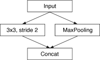
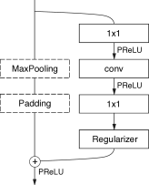

#! https://zhuanlan.zhihu.com/p/559338022
# [Notes][Vision][Segmentation] ENet

* url: https://arxiv.org/abs/1606.02147
* Title: ENet: A Deep Neural Network Architecture for Real-Time Semantic Segmentation
* Year: 07 Jun `2016`
* Authors: Adam Paszke, Abhishek Chaurasia, Sangpil Kim, Eugenio Culurciello
* Institutions: [Faculty of Mathematics, Informatics and Mechanics, University of Warsaw, Poland], [Electrical and Computer Engineering, Purdue University, USA]
* Abstract: The ability to perform pixel-wise semantic segmentation in real-time is of paramount importance in mobile applications. Recent deep neural networks aimed at this task have the disadvantage of requiring a large number of floating point operations and have long run-times that hinder their usability. In this paper, we propose a novel deep neural network architecture named ENet (efficient neural network), created specifically for tasks requiring low latency operation. ENet is up to 18x faster, requires 75x less FLOPs, has 79x less parameters, and provides similar or better accuracy to existing models. We have tested it on CamVid, Cityscapes and SUN datasets and report on comparisons with existing state-of-the-art methods, and the trade-offs between accuracy and processing time of a network. We present performance measurements of the proposed architecture on embedded systems and suggest possible software improvements that could make ENet even faster.

----------------------------------------------------------------------------------------------------

## 1 Introduction

> Even though CNNs are increasingly successful at classification and categorization tasks, they provide coarse spatial results when applied to pixel-wise labeling of images. Therefore, they are often cascaded with other algorithms to refine the results, such as color based segmentation clement13 or conditional random fields liang14 , to name a few.

> In order to both spatially classify and finely segment images, several neural network architectures have been proposed, such as SegNet badrinarayanan15basic ; badrinarayanan15 or fully convolutional networks long15 . All these works are based on a VGG16 simonyan14 architecture, which is a very large model designed for multi-class classification.

> In this paper, we propose a new neural network architecture optimized for fast inference and high accuracy.

## 2 Related work

Encoder-Decoder Architecture

> State-of-the-art scene-parsing CNNs use two separate neural network architectures combined together: an encoder and a decoder.

> The encoder is a vanilla CNN (such as VGG16 simonyan14 ) which is trained to classify the input, while the decoder is used to upsample the output of the encoder.

> However, these networks are slow during inference due to their large architectures and numerous parameters.

Post-Processing

> Other existing architectures use simpler classifiers and then cascade them with `Conditional Random Field` (CRF) as a post-processing step.

> As shown in badrinarayanan15 , these techniques use onerous post-processing steps and often fail to label the classes that occupy fewer number of pixels in a frame.

> CNNs can be also combined with `recurrent neural networks` zheng2015conditional to improve accuracy, but then they suffer from speed degradation.

## 3 Network architecture

    
    

> We adopt a view of ResNets he2015resnet that describes them as having a single main branch and extensions with convolutional filters that separate from it, and then merge back with an element-wise addition, as shown in Figure 1(b).

> Each block consists of three convolutional layers:
> * a 1x1 `projection` that reduces the dimensionality,
> * a main `convolutional` layer (conv in Figure 1(b)), and
> * a 1x1 `expansion`.

> We place `Batch Normalization` ioffe2015batchnorm and `PReLU` he2015 between all convolutions.

Types of the main convolution:

> If the bottleneck is `downsampling`, a max pooling layer is added to the main branch. Also, the first 1x1 projection is replaced with a 2x2 convolution with stride 2 in both dimensions. We zero pad the activations, to match the number of feature maps.

> conv is either a regular, `dilated` or full convolution (also known as `deconvolution` or fractionally strided convolution) with 3x3 filters.

> Sometimes we replace it with `asymmetric` convolution i.e. a sequence of 5x1 and 1x5 convolutions.

Details:

> For the regularizer, we use Spatial Dropout tompson15 , with p=0.01 before bottleneck2.0, and p=0.1 afterwards.

> These three first stages are the encoder. Stage 4 and 5 belong to the decoder.

> In the decoder max pooling is replaced with max unpooling, and padding is replaced with spatial convolution without bias.

## 4 Design choices

**Feature map resolution**

> Downsampling images during semantic segmentation has two main drawbacks.
> 1. Firstly, reducing feature map resolution implies loss of spatial information like exact edge shape.
> 2. Secondly, full pixel segmentation requires that the output has the same resolution as the input. This implies that strong downsampling will require equally strong upsampling, which increases model size and computational cost.

> The first issue has been addressed in FCN long15 by adding the feature maps produced by encoder, and in SegNet badrinarayanan15basic by saving indices of elements chosen in max pooling layers, and using them to produce sparse upsampled maps in the decoder.

> However, downsampling has one big advantage. Filters operating on downsampled images have a bigger receptive field, that allows them to gather more context.

**Early downsampling**

> ENet first two blocks heavily reduce the input size, and use only a small set of feature maps. The idea behind it, is that visual information is highly spatially redundant, and thus can be compressed into a more efficient representation.

**Decoder size**

> SegNet is a very symmetric architecture, as the encoder is an exact mirror of the encoder. Instead, our architecture consists of a large encoder, and a small decoder. This is motivated by the idea that the encoder should be able to work in a similar fashion to original classification architectures, i.e. to operate on smaller resolution data and provide for information processing and filtering. Instead, the role of the the decoder, is to upsample the output of the encoder, only fine-tuning the details.

**Nonlinear operations**

> It is notable that the decoder weights become much more positive and learn functions closer to identity. This confirms our intuitions that the decoder is used only to fine-tune the upsampled output.

**Information-preserving dimensionality changes**

> As stated earlier, it is necessary to downsample the input early, but aggressive dimensionality reduction can also hinder the information flow.

> It has been argued that a method used by the VGG architectures, i.e. as performing a pooling followed by a convolution expanding the dimensionality, however relatively cheap, introduces a representational bottleneck (or forces one to use a greater number of filters, which lowers computational efficiency).

> Therefore, as proposed in szegedy2015rethinking , we chose to perform pooling operation in parallel with a convolution of stride 2, and concatenate resulting feature maps. This technique allowed us to speed up inference time of the initial block 10 times.

> When downsampling, the first 1x1 projection of the convolutional branch is performed with a stride of 2 in both dimensions, which effectively discards 75% of the input. Increasing the filter size to 2x2 allows to take the full input into consideration, and thus improves the information flow and accuracy.

**Factorizing filters**

> It has been shown that convolutional weights have a fair amount of redundancy, and each $n \times n$ convolution can be decomposed into two smaller ones following each other: one with a $n \times 1$ filter and the other with a $1 \times n$ filter jin2014flattened .

> What’s more, a sequence of operations used in the bottleneck module (projection, convolution, projection) can be seen as decomposing one large convolutional layer into a series of smaller and simpler operations, that are its low-rank approximation.

> Such factorization allows for large speedups, and greatly reduces the number of parameters, making them less redundant jin2014flattened .

> Additionally, it allows to make the functions they compute richer, thanks to the non-linear operations that are inserted between layers.

**Dilated convolutions**

> As argued above, it is very important for the network to have a wide receptive field, so it can perform classification by taking a wider context into account.

> We wanted to avoid overly downsampling the feature maps, and decided to use dilated convolutions yu2015dilated to improve our model.

> These gave a significant accuracy boost.

**Regularization**

> inspired by huang2016stochastic , we have tried stochastic depth, which increased accuracy. However it became apparent that dropping whole branches (i.e. setting their output to 0) is in fact a special case of applying Spatial Dropout tompson15 , where either all of the channels, or none of them are ignored, instead of selecting a random subset.

> We placed Spatial Dropout at the end of convolutional branches, right before the addition, and it turned out to work much better than stochastic depth.

## 5 Results

## 6 Conclusion

> We have proposed a novel neural network architecture designed from the ground up specifically for semantic segmentation. Our main aim is to make efficient use of scarce resources available on embedded platforms, compared to fully fledged deep learning workstations. Our work provides large gains in this task, while matching and at times exceeding existing baseline models, that have an order of magnitude larger computational and memory requirements.

----------------------------------------------------------------------------------------------------

## References

* Paszke, Adam, et al. "Enet: A deep neural network architecture for real-time semantic segmentation." *arXiv preprint arXiv:1606.02147* (2016).

## Further Reading

* [3] [VGGNet](https://zhuanlan.zhihu.com/p/563314926)
* [10] SegNet-Basic
* [11] [SegNet](https://zhuanlan.zhihu.com/p/568804052)
* [12] [Fully Convolutional Networks (FCN)](https://zhuanlan.zhihu.com/p/561031110)
* [13] [VGGNet](https://zhuanlan.zhihu.com/p/563314926)
* [24] ResNet
