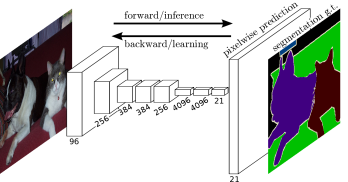
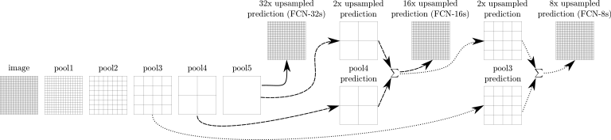

#! https://zhuanlan.zhihu.com/p/561031110
# [Notes][Vision][Segmentation] Fully Convolutional Networks

* url: https://arxiv.org/abs/1411.4038
* Title: Fully Convolutional Networks for Semantic Segmentation
* Year: 14 Nov `2014`
* Authors: Jonathan Long, Evan Shelhamer, Trevor Darrell
* Abstract: Convolutional networks are powerful visual models that yield hierarchies of features. We show that convolutional networks by themselves, trained end-to-end, pixels-to-pixels, exceed the state-of-the-art in semantic segmentation. Our key insight is to build "fully convolutional" networks that take input of arbitrary size and produce correspondingly-sized output with efficient inference and learning. We define and detail the space of fully convolutional networks, explain their application to spatially dense prediction tasks, and draw connections to prior models. We adapt contemporary classification networks (AlexNet, the VGG net, and GoogLeNet) into fully convolutional networks and transfer their learned representations by fine-tuning to the segmentation task. We then define a novel architecture that combines semantic information from a deep, coarse layer with appearance information from a shallow, fine layer to produce accurate and detailed segmentations. Our fully convolutional network achieves state-of-the-art segmentation of PASCAL VOC (20% relative improvement to 62.2% mean IU on 2012), NYUDv2, and SIFT Flow, while inference takes one third of a second for a typical image.

----------------------------------------------------------------------------------------------------

## Summary of Main Contributions

* Reinterpretation of fully connected layers as fully convolutional layers.
* Combining outputs of different pooling layers in different backbones including AlexNet, VGGNet, and GoogLeNet.

----------------------------------------------------------------------------------------------------

## 1. Introduction

> We show that a fully convolutional network (FCN), trained end-to-end, pixels-to-pixels on semantic segmentation exceeds the state-of-the-art without further machinery.

> Fully convolutional versions of existing networks predict dense outputs from arbitrary-sized inputs.

> Our approach does not make use of pre- and post-processing complications, including superpixels [8, 16], proposals [16, 14], or post-hoc refinement by random fields or local classifiers [8, 16].

> Our model transfers recent success in classification [19, 31, 32] to dense prediction by reinterpreting classification nets as fully convolutional and fine-tuning from their learned representations.

> Semantic segmentation faces an inherent tension between semantics and location: global information resolves what while local information resolves where. Deep feature hierarchies jointly encode location and semantics in a local-to-global pyramid.

> We define a novel “skip” architecture to combine deep, coarse, semantic information and shallow, fine, appearance information in Section 4.2 (see Figure 3).

## 2. Related work

> We now re-architect and fine-tune classification nets to direct, dense prediction of semantic segmentation.

**Fully convolutional networks**

**Dense prediction with convnets**

> Several recent works have applied convnets to dense prediction problems.

> Common elements of these approaches include
> * small models restricting capacity and receptive fields;
> * patchwise training [27, 2, 8, 28, 11];
> * post-processing by superpixel projection, random field regularization, filtering, or local classification [8, 2, 11];
> * input shifting and output interlacing for dense output [28, 11] as introduced by OverFeat [29];
> * multi-scale pyramid processing [8, 28, 11];
> * saturating tanh nonlinearities [8, 5, 28]; and
> * ensembles [2, 11].

> Unlike these existing methods, we adapt and extend deep classification architectures, using image classification as supervised pre-training, and fine-tune fully convolutionally to learn simply and efficiently from whole image inputs and whole image ground thruths.

## 3. Fully convolutional networks

Notations:
* Let $H, W \in \mathbb{Z}_{++}$ denote the height and width of the input feature map to the layer.
* Let $x_{i,j} \in \mathbb{R}^{c_{1}}$ denote the data vector at location $(i, j)$ of the input feature map to the layer.
* Let $y_{i,j} \in \mathbb{R}^{c_{2}}$ denote the data vector at location $(i, j)$ of the output feature map of the layer.
* Let $k \in \mathbb{Z}_{++}$ denote the kernel size.
* Let $s \in \mathbb{Z}_{++}$ denote the strides.
* Let $f_{ks}: \mathbb{R}^{H \times W \times c_{1}} \to \mathbb{R}^{H \times W \times c_{2}}$ denote the layer.

Then
$$y_{i,j} = f_{ks}(\{x_{s \cdot i+\Delta{i}, s \cdot j + \Delta{j}}: 0 \leq \Delta{i}, \Delta{j} \leq k\}).$$

> This functional form is maintained under composition, with kernel size and stride obeying the transformation rule

$$f_{ks} \circ g_{k's'} = (f \circ g)_{k'+(k-1)s', ss'}.$$

> An FCN naturally operates on an input of any size, and produces an output of corresponding (possibly resampled) spatial dimensions.

### 3.1. Adapting classifiers for dense prediction

> Typical recognition nets, including LeNet [21], AlexNet [19], and its deeper successors [31, 32], ostensibly take fixed-sized inputs and produce nonspatial outputs. The fully connected layers of these nets have fixed dimensions and throw away spatial coordinates.

> However, these fully connected layers can also be viewed as convolutions with kernels that cover their entire input regions. Doing so casts them into fully convolutional networks that take input of any size and output classification maps.

> The spatial output maps of these convolutionalized models make them a natural choice for dense problems like semantic segmentation. With ground truth available at every output cell, both the forward and backward passes are straightforward, and both take advantage of the inherent computational efficiency (and aggressive optimization) of convolution.

> While our reinterpretation of classification nets as fully convolutional yields output maps for inputs of any size, the output dimensions are typically reduced by subsampling.

### 3.2. Shift-and-stitch is filter rarefaction

> Input shifting and output interlacing is a trick that yields dense predictions from coarse outputs without interpolation, introduced by OverFeat [29].

### 3.3. Upsampling is backwards strided convolution

### 3.4. Patchwise training is loss sampling

## 4. Segmentation Architecture

    

### 4.1. From classifier to dense FCN

### 4.2. Combining what and where

    

> We define a new fully convolutional net (FCN) for segmentation that combines layers of the feature hierarchy and refines the spatial precision of the output.

> While fully convolutionalized classifiers can be fine-tuned to segmentation as shown in 4.1, and even score highly on the standard metric, their output is dissatisfyingly coarse (see Figure 4).

> We address this by adding links that combine the final prediction layer with lower layers with finer strides. This turns a line topology into a DAG, with edges that skip ahead from lower layers to higher ones (Figure 3).

> Combining fine layers and coarse layers lets the model make local predictions that respect global structure.

**Refinement by other means**

### 4.3. Experimental framework

## 5. Results

## 6. Conclusion

----------------------------------------------------------------------------------------------------

## References

* Long, Jonathan, Evan Shelhamer, and Trevor Darrell. "Fully convolutional networks for semantic segmentation." *Proceedings of the IEEE conference on computer vision and pattern recognition*. 2015.

## Further Reading

* [12] R-CNN
* [16] Simultaneous Detection and Segmentation (SDS)
* [17] Spatial Pyramid Pooling (SPP)
* [19] [AlexNet](https://zhuanlan.zhihu.com/p/565285454)
* [21] LeNet
* [29] OverFeat
* [31] [VGGNet](https://zhuanlan.zhihu.com/p/563314926)
* [32] [InceptionNetV1](https://zhuanlan.zhihu.com/p/564141144)
* [36] DropConnect
