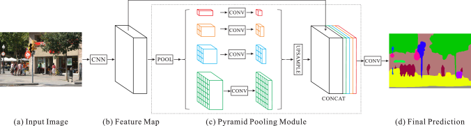

#! https://zhuanlan.zhihu.com/p/560041245
# [Notes][Vision][Segmentation] PSPNet

* url: https://arxiv.org/abs/1612.01105
* Title: Pyramid Scene Parsing Network
* Year: 04 Dec `2016`
* Authors: Hengshuang Zhao, Jianping Shi, Xiaojuan Qi, Xiaogang Wang, Jiaya Jia
* Institutions: [The Chinese University of Hong Kong], [SenseTime Group Limited]
* Abstract: Scene parsing is challenging for unrestricted open vocabulary and diverse scenes. In this paper, we exploit the capability of global context information by different-region-based context aggregation through our pyramid pooling module together with the proposed pyramid scene parsing network (PSPNet). Our global prior representation is effective to produce good quality results on the scene parsing task, while PSPNet provides a superior framework for pixel-level prediction tasks. The proposed approach achieves state-of-the-art performance on various datasets. It came first in ImageNet scene parsing challenge 2016, PASCAL VOC 2012 benchmark and Cityscapes benchmark. A single PSPNet yields new record of mIoU accuracy 85.4% on PASCAL VOC 2012 and accuracy 80.2% on Cityscapes.

----------------------------------------------------------------------------------------------------

## 1. Introduction

> Our main contributions are threefold.
> 1. We propose a pyramid scene parsing network to embed difficult scenery context features in an FCN based pixel prediction framework.
> 2. We develop an effective optimization strategy for deep ResNet [13] based on deeply supervised loss.
> 3. We build a practical system for state-of-the-art scene parsing and semantic segmentation where all crucial implementation details are included.

## 2. Related Work

> Our baseline network is FCN and dilated network [26, 3].

## 3. Pyramid Scene Parsing Network

    

### 3.1. Important Observations

**Mismatched Relationship**

> Context relationship is universal and important especially for complex scene understanding. There exist co-occurrent visual patterns.

> For example, an airplane is likely to be in runway or fly in sky while not over a road. For the first-row example in Fig. 2, FCN predicts the boat in the yellow box as a "car" based on its appearance. But the common knowledge is that a car is seldom over a river.

> Lack of the ability to collect contextual information increases the chance of misclassification.

**Confusion Categories**

> This problem can be remedied by utilizing the relationship between categories.

**Inconspicuous Classes**

> Scene contains objects/stuff of arbitrary size. Several small-size things, like streetlight and signboard, are hard to find while they may be of great importance. Contrarily, big objects or stuff may exceed the receptive field of FCN and thus cause discontinuous prediction.

> To improve performance for remarkably small or large objects, one should pay much attention to different sub-regions that contain inconspicuous-category stuff.

> To summarize these observations, many errors are partially or completely related to contextual relationship and global information for different receptive fields. Thus a deep network with a suitable `global-scene-level prior` can much improve the performance of scene parsing.

### 3.2. Pyramid Pooling Module

> With above analysis, in what follows, we introduce the pyramid pooling module, which empirically proves to be an effective `global contextual prior`.

> `Global average pooling` is a good baseline model as the `global contextual prior`, which is commonly used in image classification tasks [34, 13].

> To further reduce context information loss between different sub-regions, we propose a `hierarchical global prior`, containing information with different scales and varying among different sub-regions. We call it pyramid pooling module for global scene prior construction upon the final-layer-feature-map of the deep neural network, as illustrated in part (c) of Fig. 3.

Notations:
* Let $H, W \in \mathbb{Z}_{++}$ denote the height and width of the input feature map.
* Let $x \in \mathbb{R}^{H \times W \times N}$ denote the input feature map to the pyramid pooling module.
* Let $L \in \mathbb{Z}_{++}$ denote the number of levels in the pyramid.
* Let $B_{1}, ..., B_{L} \in \mathbb{Z}_{++}$ denote the bin sizes for each pyramid level.
* Define for each $i \in \{1, ..., L\}$ the height and width $H_{i}, W_{i} \in \mathbb{Z}_{++}$ of the feature maps at the $i$-th level by
$$H_{i} := H / B_{i} \text{ and } W_{i} := W / B_{i}.$$
* Let $\mathcal{P}_{i}: \mathbb{R}^{H \times W \times N} \to \mathbb{R}^{H_{i} \times W_{i} \times N}$ denote the average/max pooling layer at the $i$-th level.
* Let $K_{1}, ..., K_{L} \in \mathbb{R}^{1 \times 1 \times N}$ denote the 1x1 convolutional kernels.
* Let $\mathcal{U}_{i}: \mathbb{R}^{H_{i} \times W_{i} \times 1} \to \mathbb{R}^{H \times W \times 1}$ denote the upsampling layer at the $i$-th level.

Then the pyramid pooling module $\mathcal{F}: \mathbb{R}^{H \times W \times N} \to \mathbb{R}^{H \times W \times (N+L)}$ is given by:
$$\mathcal{F}(x) := \operatorname{Concatenate}\bigg(\{x\} \cup \bigg\{\mathcal{U}_{i}(\mathcal{P}_{i}(x) * K_{i}): i \in \{1, ..., L\}\bigg\}\bigg).$$

### 3.3. Network Architecture

> Using our 4-level pyramid, the pooling kernels cover the whole, half of, and small portions of the image. They are fused as the global prior. Then we concatenate the prior with the original feature map in the final part of (c).

> To explain our structure, PSPNet provides an effective global contextual prior for pixel-level scene parsing. The pyramid pooling module can collect levels of information, more representative than global pooling [24].

## 4. Deep Supervision for ResNet-Based FCN

## 5. Experiments

## 6. Concluding Remarks

> The global pyramid pooling feature provides additional contextual information.

----------------------------------------------------------------------------------------------------

## References

* Zhao, Hengshuang, et al. "Pyramid scene parsing network." *Proceedings of the IEEE conference on computer vision and pattern recognition*. 2017.

## Further Reading

* [12] Spatial Pyramid Pooling (SPP)
* [13] [ResNet](https://zhuanlan.zhihu.com/p/570072614)
* [17] [AlexNet](https://zhuanlan.zhihu.com/p/565285454)
* [19] Deeply-Supervised Nets (DSN)
* [24] ParseNet
* [26] [Fully Convolutional Networks (FCN)](https://zhuanlan.zhihu.com/p/561031110)
* [30] [DeconvNet](https://zhuanlan.zhihu.com/p/558646271)
* [33] [VGGNet](https://zhuanlan.zhihu.com/p/563314926)
* [34] [InceptionNetV1/GoogLeNet](https://zhuanlan.zhihu.com/p/564141144)
