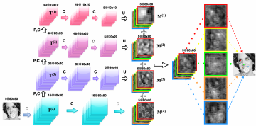
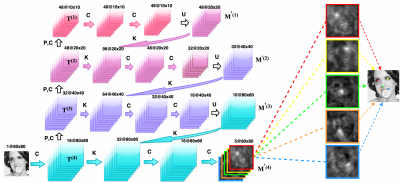

#! https://zhuanlan.zhihu.com/p/558356810
# [Notes][Vision][Segmentation] Recombinator Networks

* url: https://arxiv.org/abs/1511.07356
* Title: Recombinator Networks: Learning Coarse-to-Fine Feature Aggregation
* Year: 23 Nov `2015`
* Authors: Sina Honari, Jason Yosinski, Pascal Vincent, Christopher Pal
* Institutions: [University of Montreal], [Cornell University], [Ecole Polytechnique of Montreal], [CIFAR]
* Abstract: Deep neural networks with alternating convolutional, max-pooling and decimation layers are widely used in state of the art architectures for computer vision. Max-pooling purposefully discards precise spatial information in order to create features that are more robust, and typically organized as lower resolution spatial feature maps. On some tasks, such as whole-image classification, max-pooling derived features are well suited; however, for tasks requiring precise localization, such as pixel level prediction and segmentation, max-pooling destroys exactly the information required to perform well. Precise localization may be preserved by shallow convnets without pooling but at the expense of robustness. Can we have our max-pooled multi-layered cake and eat it too? Several papers have proposed summation and concatenation based methods for combining upsampled coarse, abstract features with finer features to produce robust pixel level predictions. Here we introduce another model --- dubbed Recombinator Networks --- where coarse features inform finer features early in their formation such that finer features can make use of several layers of computation in deciding how to use coarse features. The model is trained once, end-to-end and performs better than summation-based architectures, reducing the error from the previous state of the art on two facial keypoint datasets, AFW and AFLW, by 30\% and beating the current state-of-the-art on 300W without using extra data. We improve performance even further by adding a denoising prediction model based on a novel convnet formulation.

----------------------------------------------------------------------------------------------------

## 1. Introduction

> This work makes the following contributions:
> 1. We propose a novel architecture - the Recombinator Networks - for combining information over different spatial localization resolutions.
> 2. We show how a simple denoising model may be used to enhance model predictions.
> 3. We provide an in-depth empirical evaluation of a wide variety of relevant architectural variants.
> 4. We show state of the art performance on two widely used and competitive evaluations for facial keypoint localization.

## 2. Related work

**Keypoint localization methods**

**Approaches that combine features across multiple levels**

## 3. Summation versus Recombinator Networks

### 3.1. Summation based Networks

  

> The finest resolution layers keep positional information and use it to guide the coarser layers within the patch that they cannot have any preference, while the coarser resolution layers help finer layers to get rid of false positives.

Notations:
* Let $R \in \mathbb{Z}_{++}$ denote the number of branches.
* Let $K \in \mathbb{Z}_{++}$ denote the number of keypoints.
* Let $H, W \in \mathbb{Z}_{++}$ denote the height and width of the input image.
* Let $C \in \mathbb{Z}_{++}$ denote the number of channels of the input image.
* Let $x \in \mathbb{R}^{H \times W \times C}$ denote the input image.
* Let $H_{r}, W_{r} \in \mathbb{Z}_{++}$ given by $H_{r} := H \cdot 2^{-(R-r)}$ and $W_{r} := W \cdot 2^{-(R-r)}$ denote the height and width of the feature maps in the $r$-th branch, for $r \in \{1, ..., R\}$.
* Let $C_{r} \in \mathbb{Z}_{++}$ denote the number of channels of the input feature map to the $r$-th branch, for $r \in \{1, ..., R\}$
* Let $T_{r} \in \mathbb{R}^{H_{r} \times W_{r} \times C_{r}}$ denote the input feature map to the $r$-th branch, for $r \in \{1, ..., R\}$.
* Let $\mathcal{B}_{r}: \mathbb{R}^{H_{r} \times W_{r} \times C_{r}} \to \mathbb{R}^{H_{r} \times W_{r} \times K}$ denote the transformation by the $r$-th branch, for $r \in \{1, ..., R\}$.
* Let $\mathcal{U}_{r}: \mathbb{R}^{H_{r} \times W_{r} \times K} \to \mathbb{R}^{H \times W \times K}$ denote the upsampling of the $r$-th branch, for $r \in \{1, ..., R\}$.
Note that $\mathcal{U}_{R} = \operatorname{Id}$.
* Define $M^{(r)} \in \mathbb{R}^{H \times W \times K}$ by $$M^{(r)} := \mathcal{U}_{r}(\mathcal{B}_{r}(T_{r})),$$ for $r \in \{1, ..., R\}$.
* Let $\alpha \in \mathbb{R}^{R \times K}$ denote the weight matrix.
* Define $$\Pr(Y_{k} | X = x) := \operatorname{softmax}\bigg(\sum_{r=1}^{R}\alpha_{rk}M^{(r)}_{k}\bigg),$$ for $k \in \{1, ..., K\}$, where $M^{(r)}_{k} \in \mathbb{R}^{H \times W}$ is the $k$-th feature map of $M^{(r)}$.

Notations:
* Let $N \in \mathbb{Z}_{++}$ denote the number of training examples.
* Let $x^{(n)} \in \mathbb{R}^{H \times W \times C}$ denote the $n$-th training example.
* Let $y^{(n)} \in \mathbb{Z}^{K \times 2}$ denote the ground truth label of the $n$-th training example.

$$\mathcal{L}(\textbf{W}) := \frac{1}{N}\sum_{n=1}^{N}\underbrace{\sum_{k=1}^{K}\bigg[-\log\Pr(Y_{k}=y^{(n)}_{k} | X=x^{(n)})\bigg]}_{\mathcal{L}(x^{(n)}, y^{(n)}; \textbf{W})} + \lambda\|\textbf{W}\|^{2}.$$

### 3.2. The Recombinator Networks

  

> In the SumNet model, different branches can only communicate through the updates received from the output layer and the features are merged linearly through summation.

> In the Recombinator Networks (RCN) architecture, as shown in Figure 1(right), instead of taking a weighted sum of the upsampled feature maps in each branch and then passing them to a softmax, the output of each branch is upsampled, then concatenated with the next level branch with one degree of finer resolution.

> In contrast to the SumNet model, each branch does not end in $K$ feature maps. The information stays in the form of a keypoint independent feature map. It is only at the end of the $R$-th branch that feature maps are converted into a per-keypoint scoring representation that has the same resolution as the input image, on which a softmax is then applied.

> As a result of RCN's different architecture, branches pass more information to each other during training, such that convolutional layers in the finer branches get inputs from both coarse and fine layers, letting the network learn how to combine them non-linearly to maximize the log likelihood of the keypoints given the input images.

> We also explore RCN with skip connections, where the features of each branch are concatenated with upsampled features of not only one-level coarser branch, but all previous coarser branches.

## 4. Denoising keypoint model

## 5. Experimental setup and results

## 6. Conclusion

----------------------------------------------------------------------------------------------------

## References

* Honari, Sina, et al. "Recombinator networks: Learning coarse-to-fine feature aggregation." *Proceedings of the IEEE conference on computer vision and pattern recognition*. 2016.

## Further Reading

* [13] Hypercolumn
* [16] AlexNet
* [17] [Fully Convolutional Networks (FCN)](https://zhuanlan.zhihu.com/p/561031110)
* [19] U-Net
* [24] VGG
* [29] Inception-v1/GoogLeNet
