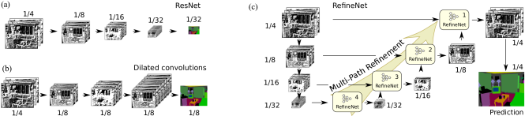
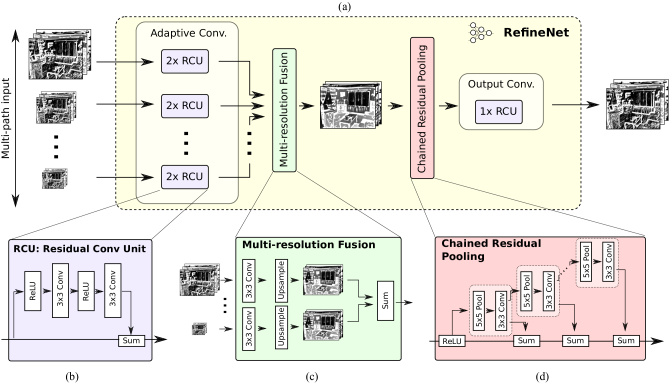
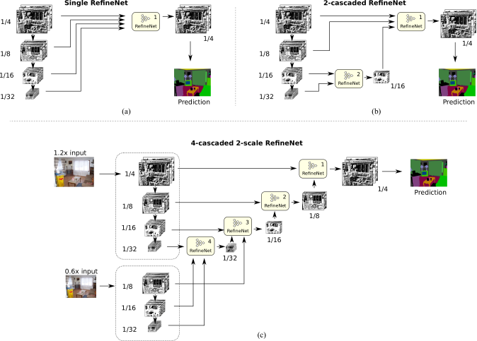

#! https://zhuanlan.zhihu.com/p/577767167
# [Notes][Vision][Segmentation] RefineNet <!-- omit in toc -->

* urls: [[abs](https://arxiv.org/abs/1611.06612)]
    [[pdf](https://arxiv.org/pdf/1611.06612.pdf)]
    [[vanity](https://www.arxiv-vanity.com/papers/1611.06612/)]
* Title: RefineNet: Multi-Path Refinement Networks for High-Resolution Semantic Segmentation
* Year: 20 Nov `2016`
* Authors: Guosheng Lin, Anton Milan, Chunhua Shen, Ian Reid
* Institutions: [The University of Adelaide], [Australian Centre for Robotic Vision]
* Abstract: Recently, very deep convolutional neural networks (CNNs) have shown outstanding performance in object recognition and have also been the first choice for dense classification problems such as semantic segmentation. However, repeated subsampling operations like pooling or convolution striding in deep CNNs lead to a significant decrease in the initial image resolution. Here, we present RefineNet, a generic multi-path refinement network that explicitly exploits all the information available along the down-sampling process to enable high-resolution prediction using long-range residual connections. In this way, the deeper layers that capture high-level semantic features can be directly refined using fine-grained features from earlier convolutions. The individual components of RefineNet employ residual connections following the identity mapping mindset, which allows for effective end-to-end training. Further, we introduce chained residual pooling, which captures rich background context in an efficient manner. We carry out comprehensive experiments and set new state-of-the-art results on seven public datasets. In particular, we achieve an intersection-over-union score of 83.4 on the challenging PASCAL VOC 2012 dataset, which is the best reported result to date.

## Table of Contents <!-- omit in toc -->

- [Summary of Main Contributions](#summary-of-main-contributions)
- [1. Introduction](#1-introduction)
  - [1.1. Related Work](#11-related-work)
- [2. Background](#2-background)
- [3. Proposed Method](#3-proposed-method)
  - [3.1. Multi-Path Refinement](#31-multi-path-refinement)
  - [3.2. RefineNet](#32-refinenet)
  - [3.3. Identity Mappings in RefineNet](#33-identity-mappings-in-refinenet)
- [4. Experiments](#4-experiments)
  - [4.1. Object Parsing](#41-object-parsing)
  - [4.2. Semantic Segmentation](#42-semantic-segmentation)
  - [4.3. Variants of cascaded RefineNet](#43-variants-of-cascaded-refinenet)
- [5. Conclusion](#5-conclusion)
- [References](#references)
- [Further Reading](#further-reading)

----------------------------------------------------------------------------------------------------

## Summary of Main Contributions

* New architecture design: Multi-Resolution Fusion, Chained Residual Pooling, and RefineNet.

----------------------------------------------------------------------------------------------------

## 1. Introduction

> Multiple stages of spatial pooling and convolution strides reduce the final image prediction typically by a factor of 32 in each dimension, thereby losing much of the finer image structure.

> One way to address this limitation is to learn deconvolutional filters as an up-sampling operation [38, 36] to generate high-resolution feature maps. The deconvolution operations are not able to recover the low-level visual features which are lost after the down-sampling operation in the convolution forward stage. Therefore, they are unable to output accurate high-resolution prediction. Low-level visual information is essential for accurate prediction on the boundaries or details.

> Another type of methods exploits features from intermediate layers for generating high-resolution prediction, e.g., the FCN method in [36] and Hypercolumns in [22]. The intuition behind these works is that features from middle layers are expected to describe mid-level representations for object parts, while retaining spatial information. This information is though to be complementary to the features from early convolution layers which encode low-level spatial visual information like edges, corners, circles, etc., and also complementary to high-level features from deeper layers which encode high-level semantic information, including object- or category-level evidence, but which lack strong spatial information.

> We argue that features from all levels are helpful for semantic segmentation. High-level semantic features helps the category recognition of image regions, while low-level visual features help to generate sharp, detailed boundaries for high-resolution prediction.

### 1.1. Related Work

## 2. Background

## 3. Proposed Method

> We propose a new framework that provides multiple paths over which information from different resolutions and via potentially long-range connections, is assimilated using a generic building block, the RefineNet.

### 3.1. Multi-Path Refinement

<figure align="center">
    
    <figcaption>
        Figure 2: Comparison of fully convolutional approaches for dense classification. Standard multi-layer CNNs, such as ResNet (a) suffer from downscaling of the feature maps, thereby losing fine structures along the way. Dilated convolutions (b) remedy this shortcoming by introducing atrous filters, but are computationally expensive to train and quickly reach memory limits even on modern GPUs. Our proposed architecture that we call RefineNet (c) exploits various levels of detail at different stages of convolutions and fuses them to obtain a high-resolution prediction without the need to maintain large intermediate feature maps. The details of the RefineNet block are outlined in Sec. 3 and illustrated in Fig 3.
    </figcaption>
</figure>

> As noted previously, we aim to exploit multi-level features for high-resolution prediction with long-range residual connections. RefineNet provides a generic means to fuse coarse high-level semantic features with finer-grained low-level features to generate high-resolution semantic feature maps.

> A crucial aspect of the design ensures that the gradient can be effortlessly propagated backwards through the network all the way to early low-level layers over long-range residual connections, ensuring that the entire network can be trained end-to-end.

### 3.2. RefineNet

<figure align="center">
    
    <figcaption>
        Figure 3: The individual components of our multi-path refinement network architecture RefineNet. Components in RefineNet employ residual connections with identity mappings. In this way, gradients can be directly propagated within RefineNet via local residual connections, and also directly propagate to the input paths via long-range residual connections, and thus we achieve effective end-to-end training of the whole system.
    </figcaption>
</figure>

**Residual convolution unit**

> The first part of each RefineNet block consists of an adaptive convolution set that mainly fine-tunes the pretrained ResNet weights for our task.

**Multi-resolution fusion**

> This block first applies convolutions for `input adaptation`, which generate feature maps of the same feature dimension (the smallest one among the inputs), and then up-samples all (smaller) feature maps to the largest resolution of the inputs. Finally, all features maps are fused by summation.

> The `input adaptation` in this block also helps to re-scale the feature values appropriately along different paths, which is important for the subsequent sum-fusion.

> If there is only one input path (e.g., the case of RefineNet-4 in Fig. 2(c)), the input path will directly go through this block without changes.

**Chained residual pooling**

> The proposed chained residual pooling aims to capture background context from a large image region. It is able to efficiently pool features with multiple window sizes and fuse them together using learnable weights.

> In particular, this component is built as a chain of multiple pooling blocks, each consisting of one max-pooling layer and one convolution layer. One pooling block takes the output of the previous pooling block as input. Therefore, the current pooling block is able to re-use the result from the previous pooling operation and thus access the features from a large region without using a large pooling window.

> The output feature maps of all pooling blocks are fused together with the input feature map through summation of residual connections.

> Note that, our choice to employ residual connections also persists in this building block, which once again facilitates gradient propagation during training.

> In one pooling block, each pooling operation is followed by convolutions which serve as a weighting layer for the summation fusion. It is expected that this convolution layer will learn to accommodate the importance of the pooling block during the training process.

**Output convolutions**

### 3.3. Identity Mappings in RefineNet

> Note that we include one non-linear activation layer (ReLU) in the chained residual pooling block. We observed that this ReLU is important for the effectiveness of subsequent pooling operations and it also makes the model less sensitive to changes in the learning rate. We observed that one single ReLU in each RefineNet block does not noticeably reduce the effectiveness of gradient flow.

> We have both short-range and long-range residual connections in RefineNet. Short-range residual connections refer to local shot-cut connections in one RCU or the residual pooling component, while long-range residual connections refer to the connection between RefineNet modules and the ResNet blocks. With long-range residual connections, the gradient can be directly propagated to early convolution layers in ResNet and thus enables end-to-end training of all network components.

## 4. Experiments

### 4.1. Object Parsing

### 4.2. Semantic Segmentation

### 4.3. Variants of cascaded RefineNet

<figure align="center">
    
    <figcaption>
        Figure 7: Illustration of 3 variants of our network architecture: (a) single RefineNet, (b) 2-cascaded RefineNet and (c) 4-cascaded RefineNet with 2-scale ResNet. Note that our proposed RefineNet block can seamlessly handle different numbers of inputs of arbitrary resolutions and dimensions without any modification.
    </figcaption>
</figure>

> For the 2-scale model in Fig. 7(c), we use 2 scales of the image as input and respectively 2 ResNets to generate feature maps; the input image is scaled to a factor of 1.2 and 0.6 and fed into 2 independent ResNets.

> This experiment demonstrates that the 4-cascaded version yields better performance than the 2-cascaded and 1-cascaded version, and using 2-scale image input with 2 ResNet is better than using 1-scale input.

> This is expected due to the larger capacity of the network. However, it also results in longer training times. Hence, we resort to using the single-scale 4-cascaded version as the standard architecture in all our experiments.

## 5. Conclusion

----------------------------------------------------------------------------------------------------

## References

* Lin, Guosheng, et al. "Refinenet: Multi-path refinement networks for high-resolution semantic segmentation." *Proceedings of the IEEE conference on computer vision and pattern recognition*. 2017.

## Further Reading

* [2] [SegNet](https://zhuanlan.zhihu.com/p/568804052)
* [5] DeepLabV1
* [6] DeepLabV2
* [18] R-CNN
* [22] Hypercolumn
* [24] [ResNet](https://zhuanlan.zhihu.com/p/570072614)
* [25] ResNetV2
* [36] [Fully Convolutional Networks (FCN)](https://zhuanlan.zhihu.com/p/561031110)
* [38] [DeconvNet](https://zhuanlan.zhihu.com/p/558646271)
* [42] [VGGNet](https://zhuanlan.zhihu.com/p/563314926)
* 